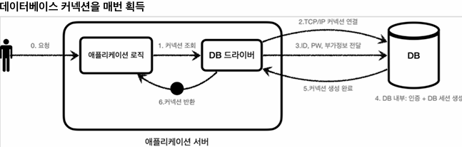
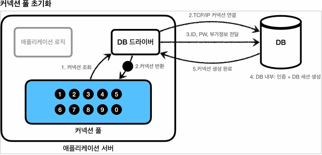
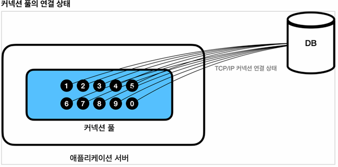
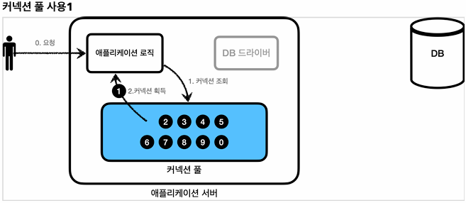
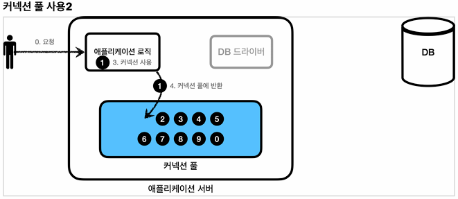
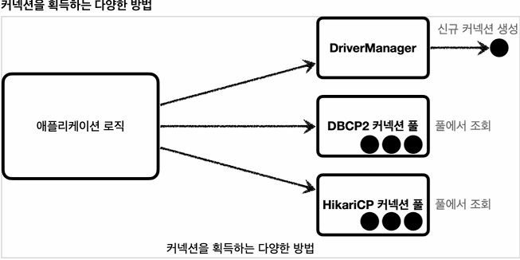
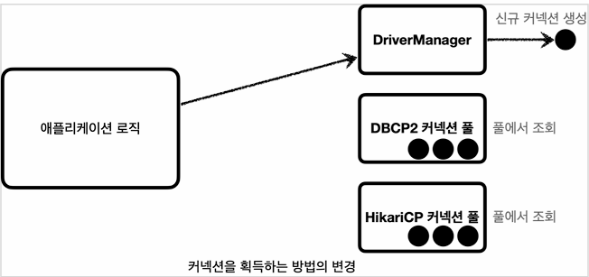
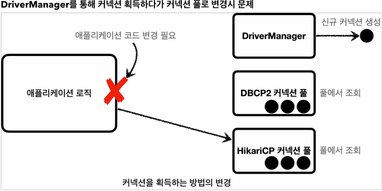
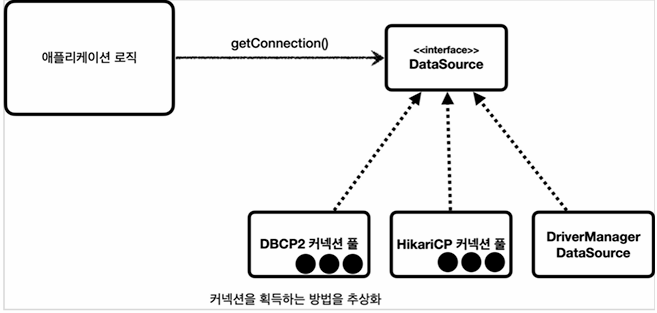

## 본문

### 커넥션풀 이해

    - 데이터베이스 커넥션을 획들할 때는 다음과 같은 복잡한 과정을 거친다.
    1) 애플리케이션 로직은 DB 드라이버를 통해 커넥션을 조회한다.
    2) DB 드라이버는 DB와 TCP/IP 커넥션을 연결한다. 물론 이 과정에서 3way handshake 같은 TCP/IP 연결을 위한 네트워크 동작이 발생한다.
        ㄴ Three-Way Handshake 
            1) Connection Establishment (연결 설정)
            2) Data Transfer (데이터 전송)
            3) Connection termination (연결 종료)
    3) DB 드라이버는 TCP/IP 커넥션이 연결되면 ID, PW와 기타 부가정보를 DB에 전달한다.
    4) DB는 ID, PW를 통해 내부 인증을 완료하고, 내부에 DB 세션을 생성한다.
    5) DB는 커넥션 생성이 완료되었다는 응답을 보낸다.
    6) DB 드라이버는 커넥션 객체를 생성해서 클라이언트에 반환한다.
 
    - 이렇게 커넥션을 새로 만드는 것은 과정도 복잡하고 시간도 많이 소모된다.
    DB는 물론이고 애플리케이션 서버에서도 TCP/IP 커넥션을 새로 생성하기 위한 리소스를 매번 사용해야 한다.
    문제는 고객이 애플리케이션을 사용할 때, SQL을 실행하는 시간 뿐만 아니라 커넥션을 새로 만드는 시간이 추가되기 때문에 결과적으로 응답 속도에 영향을 준다.

    ● 참고
    데이터베이스마다 커넥션을 생성하는 시간은 다르다. 시스템 상황마다 다르지마 MySQL 계열은 초단위 정도로 매우 빨리 커넥션을 확보 가능하다.반면에 수십 초 걸리는 데이터베이스도 있다.

    TCP/IP : 안정적이고 순서가 있는 데이터 전송을 보장하는 네트워크 프로토콜.

    ● 방안
    이런 문제를 한번에 해결하는 아이디어가 바로 커넥션을 미리 생성해두고 사용하는 커넥션 풀이라는 방법이다.
    커넥션 풀은 이름 그댈 커넥션을 관리하는 풀(수영장 풀을 상상)이다.

    

    - 애플리케이션을 시작하는 시점에 커넥션 풀은 필요한 만큼 커넥션을 미리 확보해서 풀에 보관한다. 보통 기본값은 10개이다.

    

    - 커넥션 풀에 들어 있는 커넥션은 TCP/IP로 DB와 커넥션이 연결되어 있는 상태이기 때문에 언제든지 즉시 SQL을 DB에 전달할 수 있다.

     

    - 애플리케이션 로직에서 이제는 DB 드라이버를 통해서 새로운 커넥션을 획득하는 것이 아니다.
    - 이제는 커넥션 풀을 통해서 이미 생성되어 있는 커넥션 객체 참조로 그냥 가져다 쓰기만 하면 된다.
    - 커넥션 풀에 커넥션을 요청하면 커넥션 풀은 자신이 가지고 있는 커넥션 중에 하나를 반환한다.

    

    - 애플리케이션 로직은 커넥션 풀에서 받은 커넥션을 사용해서 SQL을 데이터베이스에 전달하고 그 결과를 받아서 처리한다.
    - 커넥션을 모두 사용하고 나면 이제는 커넥션을 종료하는 것이 아니라, 다음에 다시 사용할 수 있도록 해당 커넥션을 그대로 커넥션 풀에 반환하면 된다. 여기서 주의할 점은 커넥션을 종료하는 것이 아니라 커넥션이 살아있는 상태로 커넥션 풀에 반환해야 한다는 것이다.

    ● 정리
    - 적절한 커넥션 풀 숫자는 서비스의 특징과 애플리케이션 서버 스페, DB 서버 스펙에 따라 다르기 때문에 성능 테스트를 통해서 정해야 한다.
    - 커넥션 풀은 서버당 최대 커넥션 수를 제한할 수 있다. 따라서 DB에 무한정 연결이 생성되는 것을 막아주어서 DB를 보호하는 효과도 있다.
    - 이런 커넥션 풀은 얻는 이점이 매우 크기 때문에 실무에서는 항상 기본으로 사용한다.
    - 커넥션 풀은 개념적으로 단순해서 직접 구현할 수도 있지만, 사용도 편리하고 성능도 뛰어난 오픈소스 커넥션 풀이 많기 때문에 오픈소스를 사용하는 것이 좋다.
    - 대표적인 커넥션 풀 오픈소스는 commons-dbcp2, tomcat-jdbc pool, HikariCP 등이 있다.
    - 성능과 사용의 편리함 측면에서 최근에는 hikariCP를 주로 사용한다.
    스프링 부트2.0 부터는 기본 커넥션 풀로 hikariCP를 제공된다. 사용의 편리함, 안전성 측면에서 이미 검증이 되었기 때문에 커넥션 풀을 사용할 때는 고민할 것 없이 hikariCP를 사용하면 된다. 실무에서도 레거시 프로잭트가 아닌 이상 대부분 hikariCP를 사용한다.

    ● 레거시 프로젝트에서의 hikariCP 사용하지 않는 이유
      - 레거시 프로젝트
          - 기존에 구축된 시스템 또는 소프트웨어 프로젝트를 의미한다. 일반적으로 오랜된 기술, 아키텍처, 그리고 코드를 포함하고 있으며, 다음과 같은 특징을 가질 수 있다.
              1) 오랜된 기술 스택 : 최신 기술이나 프레임워크 대신 오래도니 기술과 라이브러리를 사용
              2) 높은 유지보수 비용 : 코드가 복잡하고 문서화가 부족하여 유지보수 확장이 어려움
              3) 테스트 부족 : 자동화된 테스트가 부족하거나 없는 경우가 많음.
              4) 의존성 : 다른 시스템과 강하게 결합되어 있어 변경하기 어려움.

      - 사용하지 않는 이유
        - 오래된 기술과 아키택처로 인해 새로운 기술 도입이 어렵다. 커넥션 풀은 성능을 항상시키는 중요한 기술이지만, 레거시 시스템에서는 기술 부채, 문서화 부족, 안정성 우려 등의 이유로 사용하지 않는 경우가 많다.

### DataSource 이해

    - 우리가 앞서 JDBC로 개발한 애플리케이션 처럼 DriverManager를 통해서 커넥션을 획득하다가, 커넥션 풀을 사용하는 방법으로 변경하려면 어떻게 해야 할까?
    
    

    - 예를 들어서 애플리케이션 로직에서 DriverManager를 사용해서 커넥션을 획득하다가 HikariCP 같은 커넥션 풀을 사용하도록 변경하면 커넥션을 획득하는 애플리케이션 코드도 함께 변경해야 된다. 의좆관계가 DriverManager에서 HikariCP로 변경되기 때문이다. 물론 둘의 사용법도 조금씩 다르다.

 

    - 자바에서는 이런 문제를 해결하기 위해 javax.sql.DataSource라는 인터페이스를 제공한다.
    - DataSource는 커넥션을 획득하는 방법을 추상화 하는 인터페이스이다.
    - 이 인터페이스의 핵심 기능은 커넥션 조회 하나아디.(다른 일부 기능도 있지만 크게 중요하지 않다.)

    ● DataSource interface
    public interface DataSource {
        Connection getConnection() throws SQLException;
    }    

    ● 정리
    - 대부분의 커넥션 풀은 DataSource 인터페이스를 이미 구현해두었다. 따라서 개발자는 DBCP2 커넥션 풀, HikariCP 커넥션 풀의 코드를 직접 의존하는 것이 아니라 DataSource 인터페이스에만 의존하도록 애플리케이션 로직을 작성하면 된다.
    - 커넥션 풀 구현 기술을 변경하고 싶으면 해당 구현체로 갈아끼우기만 하면 된다.
    - DirverManager는 DataSource 인터페이스를 사용하지 않는다. 따라서 DriverManager는 직접 사용해야 한디. 따라서 DirverManager를 사용하다가 DataSource 기반의 커넥션 풀을 사용하도록 변경하면 관련 코드를 다 고쳐야 한다. 이런 문제를 해결하기 위해 스프링은 DriverManager도 DataSource를 통해서 사용할 수 있도록 DriverManagerDataSource라는 DataSource를 구현한 클래스를 제공한다.
    - 자바는 DataSource를 통해 커넥션을 획득하는 방법을 추상화 했다.
    이제 애플리케이션 로직은 DataSource 인터페이스만 의존하면 된다.
    덕분에 DriverManagerDataSource를 통해서 DriverManager를 사용하다가 커넥션 풀을 사용하도록 코드를 변경해도 애플리케이션 로직은 변경하지 않아도 된다.

### DataSource 예제1 - DriverManager
    ● 기존 DriverManager를 사용한 커넥션 풀 획득 방법
    @Slf4j
    public class ConnectionTest {

        @Test
        void driverManager() throws SQLException {
            Connection con1 = DriverManager.getConnection(URL, USERNAME, PASSWORD);
            Connection con2 = DriverManager.getConnection(URL, USERNAME, PASSWORD);
            log.info("connection={}, class={}", con1, con1.getClass());
            log.info("connection={}, class={}", con2, con2.getClass());
        }
    }    

    ● 실행 결과
    connection=conn0; url=jdbc:h2:tcp://..test user=SA, class=class org.h2.jdbc.JdbcConnection
    connection=conn1: url=jdbc:h2:tcp://..test user=SA, class=class org.h2.jdbc.JdbcConnection

    ● 이번에는 스프링이 제공하는 DataSource가 적용된 DriverManager인 DriverManagerDataSource 사용
    
        @Test
        void dataSourceDriverManager() throws SQLException {
            // DriverManagerDataSource - 항상 새로운 커넥션 획득
            DriverManagerDataSource dataSource = new DriverManagerDataSource(URL, USERNAME, PASSWORD);
            useDataSource(dataSource);
        }

        private void useDataSource(DataSource dataSource) throws SQLException {
            Connection con1 = dataSource.getConnection();
            Connection con2 = dataSource.getConnection();
            log.info("connection={}, class={}", con1, con1.getClass());
            log.info("connection={}, class={}", con2, con2.getClass());
        }

    ● 실행 결과
    DriverManagerDataSource - Creating new JDBC DriverManager Connection to [jdbc:h2:tcp:..test]   
    DriverManagerDataSource - Creating new JDBC DriverManager Connection to [jdbc:h2:tcp:..test] 
    connection=conn0: url=jdbc:h2:tcp://..test user=SA, class=class 
    org.h2.jdbc.JdbcConnection
    connection=conn1: url=jdbc:h2:tcp://..test user=SA, class=class 
    org.h2.jdbc.JdbcConnection    

    - 기존 코드와 비슷하지만 DriverManagerDataSource는 DataSource를 통해서 커넥션을 획득할 수 있다. 참고로 DriverManagerDataSource는 스프링에서 제공한다.

