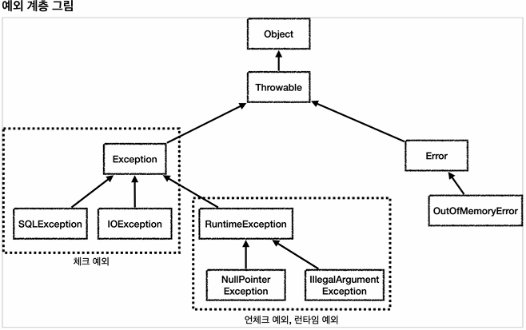
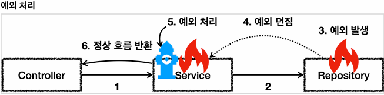
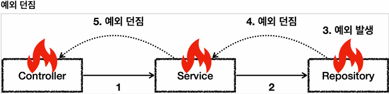
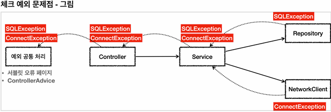

## 본문

### 예외 계층
    스프링이 제공하는 예외 추상화를 이해하기 위해서는 먼저 자바 기본 예외에 대한 이해가 필요하다. 예외는 자바 언어의 기본 문법에 들어가기 때문에 대부분 아는 내용일 것이다. 예외의 기본 내용을 간단히 복습하고, 실무에 필요한 체크 예외와 언체크 예외의 차이와 활용 방안에 대해서도 알아보자.

 

    - object : 예외도 객체이다. 모든 객체의 최상위 부모는 Object 이므로 예외의 최상위 부모도 Object 이다.

    - throwable : 최상위 예외이다. 하위에 Exception, Error 가 있다.
    - Error : 메모리 부족이나 심각한 시스템 오류와 같이 애플리케이션에서 복구 불가능한 시스템 예외이다. 애플리케이션 개발자는 이 예외를 잡으려고 해서는 안된다.
        - 상위 예외를 catch 로 잡으면 그 하위 예외까지 함께 잡는다. 따라서 애플리케이션 로직에서는 Throwable 예외도 잡으면 안되는데, 앞서 이야기한 Error 예외도 함께 잡을 수 있기 때문에 애플리케이션 로직은 이런 이유로 Exception 부터 필요한 예외로 생각하고 잡으면 된다.
        - 참고로 Error 도 언체크 예외이다.

    - Exception : 체크 예외
      - 애플리케이션 로직에서 사용할 수 있는 실질적인 최상위 예외이다.
      - Exception 과 그 하위 예외는 모두 컴파일러가 체크하는 체크 예외이다.
      단 RuntimeException은 예외로 한다.

    - RuntimeException : 언체크 예외, 런타임 예외
      - 컴파일러가 체크 하지 않는 언체크 예외이다.
      - RuntimeException 과 그 자식 예외는 모두 언체크 예외이다.
      - RuntimeException 의 이름을 따라서 RuntimeException 과 그 하위 언체크 예외를 런타임 예외라고 많이 부른다. 여기서도 앞으로는 런타임 예외로 종종 부르겟다.

### 예외 기본 규칙
    예외는 폭탄 돌리기와 같다. 잡아서 처리하거나, 처리할 수 없으면 밖으로 던져야 한다.

    - 5번에서 예외를 처리하면 이후에는 애플리케이션 로직이 정상 흐름으로 동작한다.

    

    - 예외를 처리하지 못하면 호출한 곳으로 예외를 계속 던지게 된다.

    ● 예외에 대해서는 2가지 기본 규칙을 기억하자
    1) 예외는 잡아서 처리하거나 던져야 한다.
    2) 예외를 잡거나 던질 때 지정한 예외뿐만 아니라 그 예외의 자식들도 함께 처리된다.
       - 예를 들어서 Exception 을 catch로 잡으면 그 하위 예외들도 모두 잡을 수 있다.
       - 예를 들어서 Exception 을 throws 로 던지면 그 하위 예외들도 모두 던질 수 있다.

    ● 참고 : 예외를 처리하지 못하고 계속 던지면 어떻게 될까?
    - 자바 main() 쓰레드의 경우 예외 로그를 출력하면서 시스템이 종료된다.
    - 웹 애플리케이션의 경우 여러 사용자의 요청을 처리하기 때문에 하나의 예외 때문에 시스템이 종료되면 안 된다. WAS가 해당 예외를 받아서 처리하는데, 주로 사용자에게 개발자가 지정한, 오류 페이지를 보여준다.

### 체크 예외 기본 이해
    - Exception 과 그 하위 예외는 모두 컴파일러가 체크하는 예외이다. 단 RuntimeException 은 예외로 한다.
    - 체크 예외는 잡아서 처리하거나, 또는 밖으로 던지도록 선언해야 한다. 그렇지 않으면 컴파일 오류가 발생한다.

    ● 체크 예외 전체 코드
    @Sl4fj
    public class CheckedTest {

        @Test
        void checked_catch() {
            Service service = new Service();
            service.callCatch();
        }

        @Test
        void checked_throw() {
            Service service = new Service();
            assertThatThrowBy(() -> service.callThrow())
                    .isInstanceOf(MyCheckedException.class);
        }

        /**
         *  Exception을 상속받은 예외는 체크 예외가 된다.   
         */
        static class MyCheckedException extends Exception {
            public MyCheckedException(String message) {
                super(message);
            }
        }

        /**
         *  Checked 예외는 예외를 잡아서 처리하거나, 던지거나 둘중 하나를 필수로 선택해야 한다.
         */
        static class Service {
            Repository repository = new Repository();

            /**
             *  예외를 잡아서 처리하는 코드
             */
            public void callCatch() {
                try {
                    repository.call();
                } catch (MyCheckedException e) {
                    // 예외 처리 로직
                    log.info("예외 처리, message={}", e.getMessage(), e);
                }
            } 

            /**
             *  체크 예외를 밖으로 던지는 코드
             *  체크 예외는 예외를 잡지 않고, 밖으로 던지려면 throws 예외를 메서드에 필수로 선언해야 한다.
             */
            public void callThrow() throws MyCheckedException {
                repository.call();
            } 

            static class Repository {
                public void call() throws MyCheckedException {
                    throw new MyCheckedException("ex");
                }
            }
        } 
    }

    ● Exception을 상속받은 예외는 체크 예외가 된다.
    static class MyCheckedException extends Exception {
        public MyCheckedException(String message) {
            super(message);
        }
    }       
    - MyCheckedException 는 Exception 을 상속 받았다. Exception 을 상속 받으면 체크 예외가 된다.
    - 참고로 RuntimeException 을 상속 받으면 언체크 예외가 된다.
    - 예외가 제공하는 여러가지 기본 기능이 있는데, 그 중에 오류 메시지ㄹ를 보관하는 기능도 있다. 예제에서 보는 것 처럼 생성자를 통해서 해당 기능을 그대로 사용하면 편리하다.

        @Test 
        void checked_catch() {
            Service service = new Service();
            service.callCatch();
        }
        - service.callCatch() 에서 예외를 처리했기 때문에 테스트 메서드까지 예외가 올라오지 않는다.

        ● 실행 순서
        1) test -> service.callCatch() -> repository.call() [예외발생, 던짐]
        2) test -> service.callCatch() [예외처리] <- repository.call()
        3) test [정상 흐름] <- service.callCatch() <- repository.call()

        - Repository.call() 에서 MyUncheckedException 예외가 발생하고, 그 예외를 Service.callCatch() 에서 잡는 것을 확인할 수 있다.

        ● catch는 해당 타입과 그 하위 타입을 모두 잡을 수 있다.
        public void callCatch() {
            try {
                repository.call();
            } catch (Exception e) {
                // 예외 처리 로직
            }
        }
        - catch에 MyCheckedException 의 상위 타입인 Exception 을 적어주어도 MyCheckedException 을 잡을 수 있다.
        - catch 에 예외를 지정하면 해당 예외와 그 하위 타입 예외를 모두 잡아준다.
        - 물론 정확하게 MyCheckedException 만 잡고 싶다면 catch 에 MyCheckedException 을 적어주어야 한다.

        ● 예외를 처리하지 않고, 밖으로 던지는 코드
        @Test
        void checked_throw() {
            Service service = new Service();
            assertThatThrownBy(() -> service.callThrow())
                    .isInstanceOf(MyCheckedException.class);
        }
        - service.callThrow() 에서 예외를 처리하지 않고, 밖으로 던졌기 때문에 예외가 테스트 메서드까지 올라온다.
        - 테스트에서는 기대한 것 처럼 MyCheckedException 예외가 던져지면 성공으로 처리한다.

        ● 실행 순서
        1) test -> service.callThrow() -> repository.call() [예외 발생, 던짐]
        2) test -> service.callThrow() [예외 던짐] <- repository.call()
        3) test [예외 도착] <- service.callThrow() <- repository.call()
     
        ● 체크 예외를 밖으로 던지는 코드
        public void callThrow() throws MyCheckedException {
            repository.call();
        }
        - 체크 예외를 처리할 수 없을 때는 method() throws 예외를 사용해서 밖으로 던질 예외를 필수로 지정해 주어야 한다. 여기서는 MyCheckedException을 밖으로 던지도록 지정해주었다.

        ● 체크 예외를 밖으로 던지지 않으면 컴파일 오류 발생
        public void callThrow() {
            repository.call();
        }
        - throws 를 지정하지 않으면 컴파일 오류가 발생한다.
          - Unhandled exception : hello.jdbc.exception.basic.CheckedTest.MyCheckedException
        - 체크 예외의 경우 예외를 잡아서 처리하거나 또는 throws 를 지정해서 예외를 밖으로 던진다는 선언을 필수로 해주어야 한다.

        ● 참고로 체크 예외를 밖으로 던지는 경우에도 해당 타입과 그 하위 타입을 모두 던질 수 있다.
        public void callThrow() throws Exception {
            repository.call();
        }
        - throws에 MyCheckedException 의 상위 타입인 Exception을 적어주어도 MyCheckedException을 던질 수 있다.
        - throws에 지정한 타입과 그 하위 타입 예외를 밖으로 던진다.
        - 물론 정확하게 MyCheckedException 만 밖으로 던지고 싶다면 throws 에 MyCheckedException 을 적어주어야 한다.

        ● 체크 예외의 장단점
        체크 예외는 예외를 잡아서 처리할 수 없을 때, 예외를 밖으로 던지는 throws 예외를 필수로 선언해야 한다.
        그렇지 않으면 컴파일 오류가 발생한다. 이것 때문에 장점과 단점이 동시에 존재한다.
        - 장점 : 개발자가 실수로 예외를 누락하지 않도록 컴파일러를 통해 문제를 잡아주는 훌륭한 안전 장치이다.
        - 단점 : 하지만 실제로는 개발자가 모든 체크 예외를 반드시 잡거나 던지도록 처리해야 하기 때문에, 너무 번거로운 일이 된다. 크게 신경쓰고 싶지 않은 예외까지 모두 챙겨야 한다.

### 언체크 예외 기본 이해
    - RuntimeException 과 그 하위에 예외는 언체크 예외로 분류된다.
    - 언체크 예외는 말 그대로 컴파일러가 예외를 체크하지 않는다는 뜻이다.
    - 언체크 예외는 체크 예외와 기본적으로 동일하다. 차이가 있다면 예외를 던지는 throws를 선언하지 않고, 생략할 수 있다. 이 경우 자동으로 예외를 던진다.

    ● Unchecked
    public class UncheckedTest {

        @Test
        void unchecked_catch() {
            Service service = new Service();
            service.callCatch();
        }

        @Test
        void unchecked_throw() {
            Service service = new Service();
            assertThatThrowBy(() -> service.callThrow())
                    .isInstanceOf(MyUncheckedException.class);
        }

        /**
         *  RuntimeException 을 상속받은 예외는 언체크 예외가 된다.
         */
        static class MyUncheckedException extends RuntimeException {
            public MyUncheckedException(String message) {
                super(message);
            }
        }

        /**
         *  UnChecked 예외는
         *  예외를 잡거나, 던지지 않아도 된다.
         *  예외를 잡지 않으면 자동으로 밖으로 던진다.
         */
        static class Service {

            Repository repository = new Repository();

            /**
             *  필요한 경우 예외를 잡아서 처리하면 된다.
             */
            public void callCatch() {
                try {
                    repository.call();
                } catch (MyUncheckedExeption e) {
                    // 예외 처리 로직
                    log.info("예외 처리, message={}", e.geMessage(), e);
                }
            }

            /**
             *  예외를 잡지 않아도 된다. 자연스럽게 상위로 넘어간다.
             *  체크 예외와 다르게 throws 예외 선언을 하지 않아도 된다.
             */ 
            public void callThrow() {
                repository.call();
            } 
            - 언테크 예외는 체크 예외와 다르게 throws 예외를 선언하지 않아도 된다.
            - 말 그대로 컴파일러가 이런 부분을 체크하지 않기 때문에 언체크 예외이다.

                - 언체크 예외를 밖으로 던지는 코드  
                public void callThrow() throws MyUncheckedException {
                    repository.call();
                }

            static class Repository {
                public void call() {
                    throw new MyUncheckedException("ex");
                }
            }
        } 
    }  
    - 참고로 언체크 예외도 throw 예외를 선언해도 된다. 물론 생략할 수 있다.
    - 언체크 예외는 주로 생략하지만, 중요한 예외의 경우 이렇게 선언해두면 해당 코드를 호출하는 개발자가 이런 예외가 발생한다는 점을 IDE를 통해 좀 더 편리하게 인지할 수 있다.(컴파일 시점에 막을 수 있는 것은 아니고, IDE를 통해서 인지할 수 있는 정도이다.)

    ● 언체크 예외의 장단점
    언체크 예외는 예외를 잡아서 처리할 수 없을 때, 예외를 밖으로 던지는 throws 예외를 생략할 수 있다. 이것 때문에 장점과 단점이 동시에 존재한다.
    - 장점 : 신경쓰고 싶지 않은 언체크 예외를 무시할 수 있다. 체크 예외의 경우 처리할 수 없는 예외를 밖으로 던지려면 항상 throws 예외를 선언해야 하지만, 예외는 이 부분을 생략할 수 있다. 이후에 설명하겠지만, 신경쓰고 싶지 않은 예외의 의존관계를 참조하지 않아도 되는 장점이 있다.
    - 단점 : 언체크 예외는 개발자가 실수로 예외를 누락할 수 있다. 반면에 체크 예외는 컴파일러를 통해 예외 누락을 잡아준다.      
  
    ● 정리
    체크 예외와 언체크 예외의 차이는 사실 예외를 처리할 수 없을 때 예외를 밖으로 던지는 부분에 있다. 이 부분을 필수로 선언해야 하는가 생략할 수 있는가의 차이다.

### 체크 예외 활용
    그렇다면 언제 체크 예외를 사용하고 언제 언체크(런타임) 예외를 사용하면 좋을까?
    
    ● 기본 원칙은 다음 2가지를 기억하자
    - 기본적으로 언체크 예외를 사용하자
    - 체크 예외는 비즈니스 로직상 의도적으로 던지는 예외에만 사용하자
        - 이 경우 해당 예외를 잡아서 반드시 처리해야 하는 문제일 때만 체크 예외를 사용해야 한다. 예를 들어서 다음과 같은 경우가 있다.
        - 체크 예외 ex)
            - 계좌 이체 실패 예외
            - 결제시 포인트 부족 예외
            - 로그인 ID, PW 불일치 예외
        - 물론 이 경우에도 100% 체크 예외로 만들어야 하는 것은 아니다. 다만 계좌 이체 실패처럼 매우 심각한 문제는 개발자가 실수로 예외를 놓치면 안된다고 판단할 수 있다. 이 경우 체크 예외로 만들어 두면 컴파일러를 통해 놓친 예외를 인지할 수 있다.

    ● 체크 예외의 문제점
    체크 예외는 컴파일러가 예외 누락을 체크해주기 때문에 개발자가 실수로 예외를 놓치는 것을 막아준다. 그래서 항상 명시적으로 예외를 잡아서 처리하거나, 처리할 수 없을 때는 예외를 던지도록 method() throws 예외로 선언해야 한다.
    지금까지 이야기를 들어보면 체크 예외가 런타임 예외보다 더 안전하고 좋아보이는데, 왜 체크 예외를 기본으로 사용하는 것이 문제가 될까?

    - 리포지토리는 DB에 접근해서 데이터를 저장하고 관리한다. 여기서느 SQLException 체크 예외를 던진다. 
    - NetworkClient 는 외부 네트워크에 접속해서 어떤 기능을 처리하는 객체
    
    - 서비스는 리포지토리와 NetworkClient 를 둘다 호출한다.
      - 따라서 두 곳에서 올라오는 체크 예외인 SQLException 과 ConnectException 을 처리해야 한다.
      - 그런데 서비스는 이 둘을 처리할 방법을 모른다. ConnectException 처럼 연결이 실패하거나, SQLException 처럼 데이터베이스에서 발생하는 문제처럼 심각한 문제들은 대부분 애플리케이션 로직에서 처리할 방법이 없다.

    - 서비스는 SQLException 과 ConnectException 를 처리할 수 없으므로 둘다 밖으로 던진다.
      - 체크 예외이기 때문에 던질 경우 다음과 같이 선언해야 한다.
      - method() throws SQLException, ConnectException
      
    - 컨트롤러도 두 예외를 처리할 방법이 없다.
      - 다음을 선언해서 예외를 밖으로 던진다.
      - method() throws SQLException, ConnectException
      
    - 웹 애플리케이션이라면 서블릿의 오류 페이지나, 또는 스프링 MVC가 제공하는 ControllerAdvice 에서 이런 예외를 공통으로 처리한다.

        - 이런 문제들은 보통 사용자에게 어떤 문제가 발생했는지 자세히 설명하기가 어렵다. 그래서 사용자에게는 '서비스에 문제가 있습니다.' 라는 일반적인 메시지를 보여준다. ("데이터베이스에 어떤 오류가 발생했어요")라고 알려주어도 일반 사용자가 이해할 수 없다. 그리고 보안에도 문제가 될 수 있따.
        
        - API라면 보통 HTTP 상태코드 500(내부 서버 오류)을 사용해서 응답을 내려준다.

        - 이렇게 해결이 불가능한 공통 예외는 별도의 오류 로그를 남기고, 개발자가 오류를 빨리 인지할 수 있도록 매일, 알림(문자, 슬랙)등을 통해서 전달 받아야 한다. 예를 들어서 SQLException 이 잘못된 SQL을 작성해서 발생했따면, 개발자가 해당 SQL을 수정해서 배포하기 전까지 사용자는 같은 문제를 겪게 된다.

            