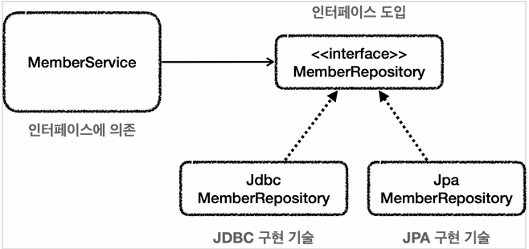
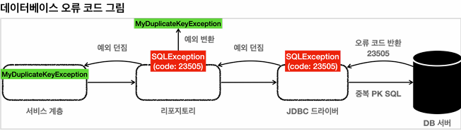

## 본문

### 체크 예외와 인터페이스
    서비스 계층은 가급적 특정 구현 기술에 의존하지 않고, 순수하게 유지하는 것이 좋다. 이렇게 하려면 예외에 대한 의존도 함께 해결해야 한다.

        ex) 
            서비스가 처리할 수 없는 SQLException 에 대한 의존을 제거하려면 어떻게 해야할까?
            서비스가 처리할 수 없으므로 리포지토리가 던지는 SQLException 체크 예외를 런타임 예외로 전환해서 서비스 계층에 던지자. 이렇게 하면 서비스 계층이 해당 예외를 무시할 수 있기 때문에, 특정 구현 기술에 의존하는 부분을 제거하고 서비스 계층을 순수하게 유지할 수 있다.    

    ● 인터페이스 도입

     

    - 이렇게 인터페이스를 도입하면 MemberService 는 MemberRepository 인터페이스에만 의존하면 된다.
    - 이제 구현 기술을 변경하고 싶으면 DI를 사용해서 MemberService 코드의 변경 없이 구현 기술을 변경할 수 있다.

    ● MemberRepository 인터페이스
    public interface MemberRepository {
        Member save(Member member);
        Member findById(String memberId);
        void update(String memberId, int money);
        void delete(String memberId);
    }
    - 특정 기술에 종속되지 않는 순수한 인터페이스이다. 이 인터페이스를 기반으로 특정 기술을 사용하는 구현체를 만들면 된다.

    ● 체크 예외와 인터페이스
    기존에는 왜 이런 인터페이스를 만들지 않았을까? 그 이유로는 다음과 같다.

        - 왜냐하면 SQLException 이 체크 예외이기 때문이다. 여기서 체크 예외가 또 발목을 잡는다. 체크 예외를 사용하려면 인터페이스에도 해당 체크 예외가 선언 되어 있어야 한다.

    ● 체크 예외 코드에 인터페이스 도입시 문제점 - 인터페이스
    public interface MemberRepositoryEx {
        Member save(Member member) throws SQLException;
        Member findById(String memberId) throws SQLException;
        void update(String memberId, int money) throws SQLException;
        void delete(String memberId) throws SQLException;
    }
    - 인터페이스의 메서드에 throws SQLException이 있는 것을 확인

    ● 체크 예외 코드에 인터페이스 도입시 문제점 - 구현 클래스
    public class MemberRepositoryV3 implements MemberRepositoryEx {
        public Member save(Member memebr) throws SQLExcetion {
            String sql = "insert into member(member_id, money) values(?, ?)";
        }
    }
    - 인터페이스의 구현체가 체크 예외를 던지려면, 인터페이스 메서드에 먼저 체크 예외를 던지는 부분이 선언되어 있어야 한다. 그래야 구현 클래스의 메서드도 체크 예외를 던질 수 있다.
      - 쉽게 이야기 해서 MemberRepositoryV3 가 throws SQLException 를 하려면 MemberRepositoryEx 인터페이스에도 throws SQLException 이 필요하다.

    - 참고로 구현 클래스의 메서드에 선언할 수 있는 예외는 부모 타입에서 던진 예외와 같거나 하위 타입이어야 한다.
     
      ex) 인터페이스 메서드에 throws Exception 를 선언하면, 구현 클래스 메서드에 throws SQLException 는 가능하다. SQLException 은 Exception 하위 타입이기 때문이다.

    ● 특정 기술에 종속되는 인터페이스
    구현 기술을 쉽게 변경하기 위해서 인터페이스를 도입하더라도 SQLException 과 같은 특정 구현 기술에 종속적인 체크 예외를 사용하게 되면 인터페이스에도 해당 예외를 포함해야 한다. 하지만 이것은 우리가 원하던 순수한 인터페이스가 아니다. JDBC 기술에 종속적인 인터페이스일 뿐이다. 인터페이스를 만드는 목적은 구현체를 쉽게 변경하기 위함인데, 이미 인터페이스가 특정 구현 기술에 오염이 되어 버렷다 . 향후 JDBC가 아닌 다른 기술로 변경한다면 인터페이스 자체를 변경해야 한다.

    ● 런타임 예외와 인터페이스 
    런타임 예외는 이런 부분에서 자유롭다. 인터페이스에 런타임 예외를 따로 선언하지 않아도 된다. 따라서 인터페이스가 특정 기술에 종속적일 필요가 없다

### 런타임 예외 적용
    ● MemberRepository 인터페이스
    public interface MemberRepository {
        Member save(Member member);
        Member findById(String memberId);
        void update(String memebrId, int money);
        void delete(String memberId);
    }          

    ● MyDbException 런타임 예외
    public class MyDbException extends RuntimeException {

        public MyDbException() {
        }

        public MyDbException(String message) {
            super(message);
        }

        public MyDbException(String message, Throwable cause) {
            super(message, cause);
        }

        public MyDbException(Throwable cause) {
            super(cause);
        }
    }
    - RuntimeException 을 상속받았따. 따라서 MyDbException 은 런타임(언체크)예외가 된다.

    ● MemberRepositoryV4_1
    /**
     *  예외 누수 문제 해결
     *  체크 예외를 런타임 예외로 변경
     *  MemberRepository 인터페이스 사용
     *  throws SQLException 제거
     */
    @Slf4j
    public class MemberRepositoryV4_1 implements MemberRepository {

        private final DataSource dataSource;

        public MemberRepositoryV4_1(DataSource dataSource) {
            this.dataSource = dataSource;
        }

        @Override
        public Member save(Member member) {
            String sql = "insert into member(member_id, money) values(?, ?)"; 

            Connection con = null;
            PreparedStatement pstmt = null;

            try {
                con = getConnection();
                pstmt = con.prepareStatement(sql);
                pstmt.setString(1, member.getMemberId());
                pstmt.setInt(2, member.getMoney());
                pstmt.executeUpdate();
                return member;
            } catch (SQLException e) {
                throw new MyDbException(e);
            } finally {
                close(con, pstmt, null);
            }
        }

        @Override
        public Member findById(String memberId) {
            String sql = "select * from member where member_id = ?";

            Connection con = null;
            PreparedStatement pstmt = null;
            ResultSet rs = null;

            try {
                con = getConnection();
                pstmt = con.prepareStatement(sql);
                pstmt.setString(1, memberId);

                rs = pstmt.executeQuery();

                id (rs.next()) {
                    Member member = new Member();
                    member.setMemberId(rs.getString("member_id"));
                    member.setMoney(rs.getInt("money"));
                    return member;
                } else {
                    throw new NoSuchElementException("member not found memberId = " + memberId);
                }
            } catch (SQLException e) {
                throw new MyDbException(e);
            } finally {
                close(con, pstmt, rs);
            }
        }

        @Override
        public void update(String memberId, int money) {
            String sql = "udpate member set money=? where member_id=?";

            Connection con = null;
            PreparedStatement pstmt = null;

            try {
                con = getConnection();
                pstmt = con.prepareStatement(sql);
                pstmt.setInt(1, money);
                pstmt.setString(2, memberId)l
                pstmt.executeUpdate();

            } catch (SQLException e) {
                throw new MyDbException(e);
            } finally {
                close(con, pstmt, null);
            }
        }

        @Override
        public void delete(String memeberId) {
            String sql = "delete from member where member_id=?";

            Connection con = null;
            PreparedStatement pstmt = null;

            try {
                con = getConnection();
                pstmt = con.prepareStatement(sql);
                pstmt.setString(1, memberId);
                pstmt.executeUpdate();
                
            } catch (SQLException e) {
                throw new MyDbException(e);
            } finally {
                close(con, pstmt, null);
            }
        }

        private void close(Connection con, Statement stmt, ResultSet rs) {
            Connection con = DataSourceUtils.getConnection(dataSource);
            log.info("get connection={} class={}", con, con.getClass());
            return con;
        }
    }
    - MemberRepository 인터페이스를 구현한다.
    - 이 코드에서 핵심은 SQLException 이라는 체크 예외를 MyDbException 이라는 런타임 예외로 변환해서 던지는 부분이다.

    ● 예외 변환
    catch (SQLException e) {
        throw new MyDbException(e);
    }
    - 잘 보면 기존 예외를 생성자를 통해서 포함하고 있는 것을 확인할 수 있다.
    예외는 원인이 되는 예외를 내부에 포함할 수 있는데, 꼭 이렇게 작성해야 한다. 그래야 예외를 출력했을 때 원인이 되는 기존 예외도 함께 확인할 수 있다.

    - MyDbException 이 내부에 SQLException 을 포함하고 있다고 이해하면 된다. 예외를 출력했을 때, 스택 트레이스를 통해 둘다 확인할 수 있다.

    ● 다음과 같이 기존 예외를 무시하고 작성하면 절대 안된다!

    - 예외 변환 : 기존 예외 무시
    catch (SQLException e) {
        throw new MyDbException();
    }
        - 잘 보면 new MyDbException() 으로 해당 예외만 생성하고 기존에 있는 SQLExceeption 은 포함하지 않고 무시한다.
        - 따라서 MyDbException 은 내부에 원인이 되는 다른 예외를 포함하지 않는다.
        - 이렇게 원인이 되는 예외를 내부에 포함하지 않으면, 예외를 스택 트레이스를 통해 출력했을 때 기존에 원인이 되는 부분을 확인할 수 없다.
          - 만약 SQLException 에서 문법 오류가 발생했다면 그 부분을 확인할 방법이 없게 된다.

        ● 주의
        예외를 변환할 때는 기존 예외를 꼭! 포함하자 장애가 발생하고 로그에서 진짜 원인이 남지 않는 심각한 문제가 발생할 수 있다. 중요한 내용이어서 한번 더 설명했다.

    ● MemberServiceV4 - MyDbException interface 적용
    /**
     *  예외 누수 문제 해결
     *  SQLException 제거
     *  MemberRepository interface 의존
     */
    @Slf4j
    @RequiredArgConstructor
    public class MemberServiceV4 {

        private final MemberRepository memberRepository;

        @Transactional
        public void accountTransfer(String fromId, String toId, int money) {
            bizLogic(fromId, toId, money);
        }

        private void bizLogic(String fromId, String toId, int money) {
            Member fromMember = memberRepository.findById(fromId);
            Member toMember = memberRepository.findById(toId);

            memberRepository.update(fromId, fromMember.getMoney() - money);
            validation(toMember);
            memberRepository.update(toId, toMember.getMoney() + money);
        }

        private void validation(Member toMember) {
            if (toMember.getMemberId().equals("ex")) {
                throw new IllegalStateException("이체중 예외 발생");
            }
        }
    }
    - MemberRepository 인터페이스에 의존하도록 코드를 변경했다.
    - MemberRepositoryV3_3와 비교해서 보면 드디어 메서드에서 throws SQLException 부분이 제거된 것을 확인할 수 있다.
    - 드디어 순수한 서비스를 완성.

    ● 정리
    - 체크 예외를 런타임 예외로 변환해서 인터페이스와 서비스 계층의 순수성을 유지할 수 있게 되었다.
    - 덕분에 향후 JDBC에서 다른 구현 기술로 변경하더라도 서비스 계층의 코드를 변경하지 않고 유지할 수 있다.

    ● 남은 문제
    리포지토리에서 넘어오는 특정한 예외의 경우 복구를 시도할 수도 있다. 그런데 지금 방식은 항상 MyDbException 이라는 예외만 넘어오기 때문에 예외를 구분할 수 없는 단점이 있다. 만약 특정 상황에는 예외를 잡아서 복구하고 싶으면 예외를 어떻게 구분해서 처리할 수 있을까?

### 데이터 접근 예외 직접 만들기
    데이터베이스 오류에 다라서 특정 예외는 복구하고 싶을 수 있다.
    예를 들어서 회원 가입시 DB에 이미 같은 ID가 있으면 ID 뒤에 숫자를 붙여서 새로운 ID를 만들어야 한다고 가정해보자.
    ID를 hello 라고 가입 시도 했는데, 이미 같은 아이디가 있으면 hello12345 와 같이 임이의 숫자를 붙여서 가입하는 것이다.

    데이터를 DB에 저장할 때 같은 ID가 이미 데이터베이스에 저장되어 있다면, 데이터베이스는 오류 코드를 반환하고, 이 오류 코드를 받은 JDBC 드라이버는 SQLException 을 던진다. 그리고 SQLException 에는 데이터베이스가 제공하는 errorCode 라는 것이 들어있다.

 

    ● H2 데이터베이스의 키 중복 오류 코드
        ex)
            e.getErrorCode() == 23505

    - SQLException 내부에 들어있는 errorCode 를 활용하면 데이터베이스에서 어떤 문제가 발생했는지 확인 할 수 있다.

    - 서비스 계층에서는 예외 복구를 위해 키 중복 오류를 확인할 수 있어야 한다. 그래서 새로운 ID를 만들어서 다시 저장을 시도할 수 있기 때문이다. 이러한 과정이 바로 예외를 확인해서 복구하는 과정이다. 리포지토리는 SQLException 을 서비스 계층에 던지고 서비스 계층은 이 예외의 오류 코드를 확인해서 키 중복 오류(23505)인 경우 새로운 ID를 만들어서 다시 저장하면 된다.

    - 그런데 SQLException 에 들어있는 오류 코드를 활용하기 위해 SQLException을 서비스 계층으로 던지게 되면, 서비스 계층이 SQLException 이라는 JDBC 기술에 의존하게 되면서, 지금까지 우리가 고민했던 서비스 계층의 순수성이 무너진다.
    
        ● 해결 방안
        -> 리포지토리에서 예외를 변환해서 던지면 된다.
            SQLException -> MyDuplicateKeyException

    ● MyDuplicateKeyException
    public class MyDuplicateKeyException extends MyDbException {

        public MyDuplicateKeyException() {
        }

        public MyDuplicateKeyException(String message) {
            super(message);
        }

        public MyDuplicateKeyException(String message, Throwable cause) {
            super(message, cause);
        }

        public MyDuplicateException(Throwable cause) {
            super(cause);
        }
    }
    - 기존에 사용했던 MyDbException 을 상속받아서 의미있는 계층을 형성한다. 이렇게하면 데이터베이스 관련 예외라는 계층을 만들 수 있다.
    - 그릐고 이름도 MyDuplicateException 이라는 이름을 지었다. 이 예외는 데이터 중복의 경우에만 던져야 한다.
    - 이 예외는 우리가 직접 만든 것이기 때문에, JDBC나 JPA 같은 특정 기술에 종속적이지 않다. 따라서 이 예외를 사용하더라도 서비스 계층의 순수성을 유지할 수 있다. (향후 JDBC에서 다른 기술로 바꾸어도 이 예외는 그대로 유지할 수 있다.)

    ● ExTranslatorV1Test
    public class ExTranslatorV1Test {

        Repository repository;
        Service service;

        @BeforeEach
        void init() {
            DriverManagerDataSource dataSource = new DriveManagerDataSource(URL, USERNAME, PASSWORD);
            repository = new Repository(dataSource);
            service = new Service(repository);
        }

        @Test
        void duplicateKeySave() {
            service.create("myId");
            service.create("myId"); // 같은 ID 저장 시도
        }

        @Slf4j
        @RequiredArgsConstructor
        static class Service {

            private void create(String memberId) {
                try {
                    repository.save(new Member(memberId, 0));
                    log.info("saveId={}", memberId);
                } catch (MyDuplicateKeyException e) {
                    log.info("키 중복, 복구 시도");
                    String retryId = generateNewId(memberId);
                    log.info("retryId={}, retryId);
                    repository.save(new Member(retryId, 0));
                } catch (MyDbException e) {
                    log.info("데이터 접근 계층 예외", e);
                    throw e;
                }
            }

            private String generateNewId(String memberId) {
                return memberId + new Random().nextInt(10000);
            }
        }

        @RequiredArgsConstructor
        static class Repository {

            private final DataSource dataSource;

            public Member save(Member member) {
                String sql = "insert into member(member_id, money) values(?, ?)";

                Connection con = null;
                PrepareStatement pstmt = null;

                try {
                    con = dataSource.getConnection();
                    pstmt = con.prepareStatement(sql);
                    pstmt.setString(1, member.getMemberId());
                    pstmt.setInt(2, member.getMoney());
                    pstmt.executeUpdate();
                    return member;
                } catch (SQLException e) {
                    // h2 db
                    if (e.getErrorCode() == 23505) {
                        throw new MyDuplicateKeyException(e);
                    }
                    throw new MyDbException(e);
                } finally {
                    closeStatement(pstmt);
                    closeConnection(con);
                }
            }
        }
    }

    ● 실행 결과 로그
    Service - saveId=myId
    Service - 키 중복, 복구 시도
    Service - retryId=myId492
        - 같은 ID를 저장했지만, 중간에 예외를 잡아서 복구한 것을 확인.

    - 리포지토리 부터 중요한 부분을 살펴보자
    } catch (SQLException e) {
        // h2 db
        if (e.getErrorCode() == 23505) {
            throw new MyDuplicateKeyException(e);
        }
        throw new MyDbException(e);
    }
        - e.getErrorCode() == 23505 : 오류 코드가 키 중복 오류인 경우
        MyDuplicateKeyException 을 새로 만들어서 서비스 계층에 던진다.
        - 나머지 경우 기존에 만들었던 MyDbException 을 던진다.

    - 서비스의 중요한 부분을 살펴보자        
        

