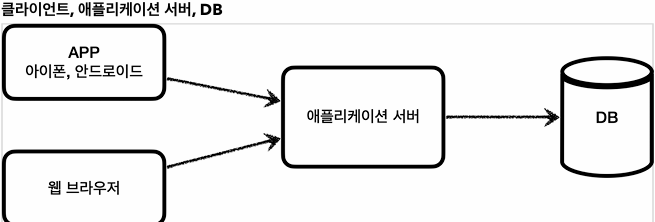
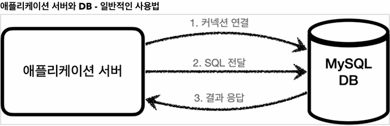
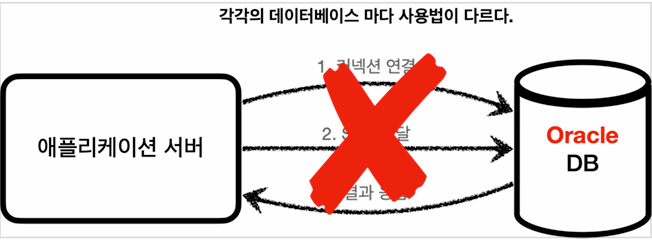
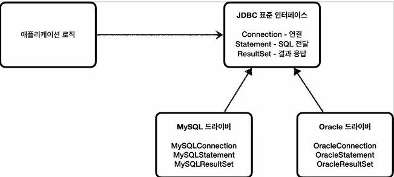
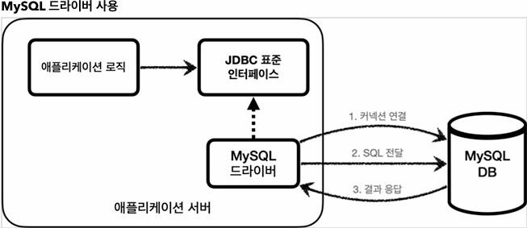
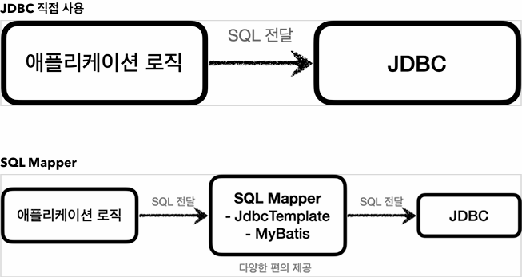
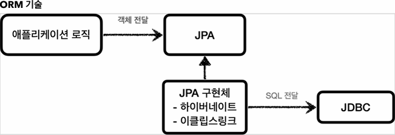
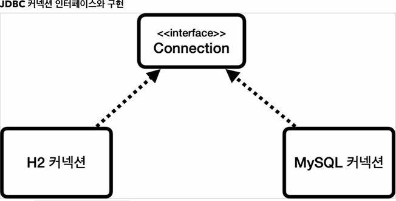
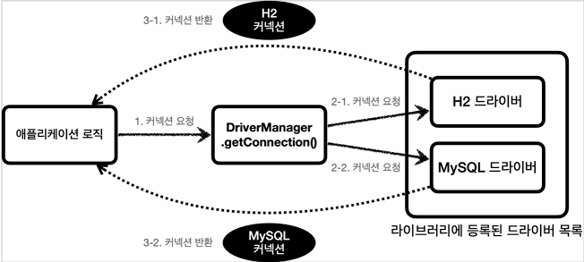

## 본문 

### JDBC 이해
    ● 설정
    dependencies {
        implementation 'org.springframework.boot:spring-boot-starter-jdbc'
        compileOnly 'org.projectlombok:lombok'
        runtimeOnly 'com.h2database:h2'
        annotationProcessor 'org.projectlombok:lombok'
        testImplementation 'org.springframework.boot:spring-boot-starter-test'

        //테스트에서 lombok 사용
        testCompileOnly 'org.projectlombok:lombok'
        testAnnotationProcessor 'org.projectlombok:lombok'
    }

    ● TABLE 생성
    drop table member if exists cascade;
    create table member {
        member_id varchar(10),
        money integer not null default 0,
        primary key (member_id)
    };

    insert into member(member_id, money) values ('hi1', 10000);
    insert into member(member_id, money) values ('hi2', 20000);

    - 클라이언트가 애플리케이션 서버를 통해 데이터를 저장하거나 조회하면, 애플리케이션 서버는 다음 과정을 통해서 데이터베이스를 사용한다.

    1.커넥션 연결 : 주로 TCP/IP를 사용해서 커넥션을 연결한다.
    2.SQL 전달 : 애플리케이션 서버는 DB가 이해할 수 있는 SQL을 연결된 커넥션을 통해 DB에 전달한다.
    3.결과 응답 : DB는 전달된 SQL을 수행하고 그 결과를 응답한다. 애플리케이션 서버는 응답 결과를 활용한다.

    - 문제는 각각의 데이터베이스마다 커넥션을 연결하는 방법, SQL을 전달하는 방법, 그리고 결과를 응답 받는 방법이 모두 다르다는 점이다.  

    1.데이터베이스를 다른 종류의 데이터베이스로 변경하면 애플리케이션 서버에 개발된 데이터베이스 사용 코드도 함께 변경해야 한다.
    2.개발자가 각각의 데이터베이스마다 커넥션 연결, SQL 전달, 그리고 그 결과를 응답 받는 방법을 새로 학습해야 한다.  

    이런 문제를 해결하기 위해 JDBC라는 자바 표준이 등장한다.
    
### JDBC 표준 인터페이스
    JDBC는 자바에서 데이터베이스에 접속할 수 있도록 하는 자바 API다.
    JDBC는 데이터베이스에서 자료를 쿼리하거나 업데이트하는 방법을 제공한다.   

    - java.sql.Connection - 연결
    - java.sql.Statement - SQL을 담은 내용
    - java.sql.ResultSet - SQL 요청 응답

    - 자바는 이렇게 표준 인터페이스를 정의해두었다. 이제부터 개발자는 이 표준 인터페이스만 사용해서 개발하면 된다.
    그런데 인터페이스만 있다고해서 기능이 동작하지는 않는다. 이 JDBC 인터페이스를 각각의 DB 벤더(회사)에서 자신의 DB에 맞도록 구현해서 라이브러리로 제공하는데, 이것을 JDBC 드라이버라 한다. 예를 들어서
    MySQL DB에 접근할 수 있는 것은 MySQL JDBC 드라이버라 하고, Oracle DB에 접근할 수 있는 것은 Oracle JDBC 드라이버라 한다.

 

    ● 정리
    JDBC의 등장으로 다음 2가지 문제가 해결되었다.
    1.데이터베이스를 다른 종류의 DB로 변경하면 애플리케이션 서버의 DB 사용 코드도 함께 변경해야하는 문제
        - 애플리키이션 로직은 이제 JDBC 표준 인터페이스에만 의존한다.
        따라서 DB를 다른 종류의 DB로 변경하고 싶으면 JDBC 구현 라이브러리만 변경하면 된다. 따라서 다른 종류의 DB로 변경해도 애플리케이션 서버의 사용 코드를 그대로 유지할 수 있다.

    2.개발자가 각각의 데이터베이스마다 커넥션 연결, SQL 전달, 그리고 그 결과를 응답 받는 방법을 새로 학습 해야하는 문제.
        - 개발자는 JDBC 표준 인터페이스 사용법만 학습하면 된다. 한번 배워두면 수십개의 데이터베이스에 모두 동일하게 적용할 수 있다.

    ● 참고 - 표준화의 한계
    JDBC의 등장으로 많은 것이 편리해졌지만, 각각의 데이터베이스마다 SQL, 데이터타입 등의 일부 사용법은 다르다.
    결국 데이터베이스를 변경하면 JDBC 코드는 변경하지 않아도 되지만 SQL은 해당 데이터베이스에 맞도록 변경해야한다.
    참고로 JPA를 사용하면 이렇게 각각의 데이터베이스 마다 다른 SQL을 정의해야 하는 문제도 많은 부분 해결할 수 있다.

### JDBC와 최신 데이터 접근 기술
    JDBC를 편리하게 사용하는 다양한 기술이 존재한다. 대표적으로 SQL Mapper와 ORM 기술로 나눌 수 있다.        

    

    ● SQL Mapper
        - 장점 : JDBC를 편리하게 사용하도록 도와준다.
          - SQL 응답 결과를 객체로 편리하게 변환해준다.
          - JDBC의 반복 코드를 제거해준다.
        - 단점 : 개발자가 SQL을 직접 작성해야한다.
        - 대표기술 : 스프링 JdbcTemplate, MyBatis

    
    ● ORM
        - ORM은 객체를 관계형 데이터베이스 테이블과 매핑해주는 기술이다. 이 기술 덕분에 개발자는 반복적인 SQL을 직접 작성하지 않고, ORM 기술이 개발자 대신에 SQL을 동작을 만들어 실행해준다. 추가로 각각의 데이터베이스마다 다른 SQL을 사용하는 문제도 중간에서 해결해준다.
        - 대표기술 : JPA, 하이버네이트, 이클립스링크
        - JPA는 자바 진영의 ORM 표준 인터페이스이고, 이것을 구현한 것으로 하이버네이트와 이클리스 링크등의 구현 기술이 있다.

    ● SQL Mapper vs ORM 기술
    SQL Mapper와 ORM 기술 둘다 각각 장단점이 있다.
    쉽게 설명하자면 SQL Mapper는 SQL만 작성할 줄 알면 사용 가능하다. ORM기술은 SQL 자체를 작성하지 않아도 되어서 개발 생산성이 매우 높아진다. 편리한 반면에 쉬운 기술은 아니므로 실무에서 사용하려면 깊이있게 학습해야 한다. 

    ● 중요
    이런 기술들도 내부에서는 모두 JDBC를 사용한다. 따라서 JDBC를 직접 사용하지는 않더라도, JDBC가 어떻게 동작하는지 기본 원리를 알아두어야 한다. JDBC는 자바 개발자라면 꼭 알아두어야 하는 필수 기본 기술이다.

### DB 연결
    ● ConnectionConst
    public abstract class ConnectionConst {
        public static final String URL = "jdbc:h2:tcp//localhost/~/test";
        public static final String USERNAME = "sa";
        public static final String PASSWORD = "";
    }              
    - DB에 접속하는데 필요한 기본 정보를 편리하게 사용할 수 있도록 상수.

    ● DBConnectionUtil
    @Slf4j
    public class DBConnectionUtil {
        public static Connection getConnection() {
            try {
                Connection conn = DriverManager.getConnection(URL, USERNAME, PASSWORD);
                log.info("get connection={}, class={}", conn, conn.getClass());
                return conn;
            } catch (SQLException e) {
                throw new IllegalStateException(e);
            }
        }
    }

    @Test
    void connection() {
        Connection conn = DBConnectionUtil.getConnection();
        assertThat(conn).isNotNull();
    }

    - 로그
    log.info("get connection={}, class={}", 
    connection, (=get.Connection(URL, USERNAME, PASSWORD)) 
    connection.getClass()); 

    - 결과 
    DBConnectionUtil - get connection=conn0: 
    url=jdbc:h2:tcp://localhost/~/test 
    user=SA, 
    (PASSWORD) = ""
    class=class org.h2.jdbc.JdbcConnection
    - 실행 결과를 보면 class=class.org.h2.jdbc.JdbcConnection 부분을 확인할 수 있다. 이것이 바로 H2 DB 드라이버가 제공하는 H2 전용 커넥션이다. 물론 이 커넥션은 JDBC 표준 커넥션 인터페이스인 java.sql.Connection 인터페이스를 구현하고 있다. 

### JDBC DriverManager 연결 이해

    - JDBC는 java.sql.Connection 표준 커넥션 인터페이스를 정의한다.
    - H2 DB 드라이버는 JDBC Connection interface를 구현한 org.h2.jdbc.JdbcConnection 구현체를 제공한다.

    - JDBC가 제공하는 DriverManager는 라이브러리에 등록된 DB 드라이버들을 관리하고, 커넥션을 획득하는 기능을 제공한다.

    1) 애플리케이견 로직에서 커넥션이 필요하면 DriverManager.getConnection()을 호출한다.
    2) DriverManager는 라이브러리에 등록된 드라이버 목록을 자동으로 인식한다. 이 드라이버들에게 순서대로 다음 정보를 넘겨서 커넥션을 획득할 수 있는지 확인한다.
       - URL : ex) jdbc:h2/tcp://localhost/~/test
       - 이름, 비밀번호 등 접속에 필요한 추가 정보
       - 여기서 각각의 드라이버는 URL 정보를 체크해서 본인이 처리할 수 있는 요청인지 확인하낟. 예를 들어서 URL이 jdbc:h2로 시작하면 이것은 h2 DB에 접근하기 위한 규칙이다. 따라서 H2 드라이버는 본인이 처리할 수 있으므로 실제 데이터베이스 연결해서 커넥션을 획득하고 이 커넥션을 클라이언트에 반환한다. 반면에 URL이 jdbc:h2로 시작했는데 MySQL 드라이버가 먼저 실행되면 이 경우 본인이 처리할 수 없다는 결과를 반환하게 되고, 다음 드라이버에게 순서가 넘어간다.
    3) 이렇게 찾은 커넥션 구현체가 클라이언트에 반환된다.
    
    - 우리는 H2 데이터베이스 드라이버만 라이브러리에 등록했기 때문에 H2 드라이버가 제공하는 H2 커넥션을 제공받는다. 물론 H2 커넥션은 JDBC가 제공하는 java.slq.Connection 인터페이스를 구현하고 있다.

### PreparedStatement
    ● 개념
    - API에서 데이터베이스와 상호작용하기 위해 사용되는 중요한 클래스이다.
    - SQL 문을 미리 컴파일하여 재사용 가능하게 하는 클래스이다. 이는 성능 향상과 SQL 인젝션 방지에 도움이 된다.

    ● 주요 특징 및 사용법
    1) SQL 문 미리 컴파일
       - SQL문을 미리 컴파일하므로, 동일한 SQL 문을 여러번 실행할 때 성능이 향상된다.
    2) 파라미터 바인딩 
       - SLQ문에서 '?'로 파라미터 위치를 표시하고, 'setXXX' 메서드로 값을 바인딩 한다.

        ex)
        public class PreparedStatement {
            public static void main(Stirng[] args) {
                String url = "jdbc:mysql://localhost:3306/mydatabase";
                String user = "yourUsername";
                String password = "yourPassword";

                String sql = "INSERT INTO mytable (name, age) VALUES (?, ?)";

                try {

                    Connection con = DriverManager.getConnection(url, user, password);
                    PreparedStatement pstmt = connection.prepareStatement(sql) 

                    pstmt.setString(1, "joo");
                    pstmt.setInt(2, 30);

                    int affectedRow = pstmt.executeUpdate();
                    System.out.println("Affected rows: " + affectedRows);

                } catch (SQLException e) {
                    e.printStackTrace();
                }
            }
        }

### ResultSet
    ● 개념
    - SQL 쿼리의 결과를 저장하고, 결과 집합을 탐색할 수 있게 하는 객체이다.

    ● 주요 특징 및 사용법
    - 기본적으로 처음에 첫 번재 행 이전에 위치하며, next() 메서드를 호출하여 다음 행으로 이동할 수 있다.
    - 행의 데이터를 getXXX 메서드 (getInt, getString 등)를 사용하여 추출한다.

        ex)
        public class ResultSet {
            public static void main(String[] args) {
                String url = "jdbc:mysql://localhost:3306/mydatabase";
                String user = "yourUsername";
                String password = "1234";

                String sql = "SELECT id, name, age FROM mytable";
                
                try {

                    Connection con = Driver ~~~
                    PreparedStatement pstmt = conn ~~~
                    ResultSet rs = pstmt.executeQuery() {

                        while (rs.next()) {
                            int id = rs.getInt("id");
                            String name = rs.getString("name");
                            int age = rs.getInt("age");
                        }
                    } catch (SQLException e) {
                        e.printStackTrace();
                    }
                }
            }
        } 
        - rs.next() 
          - ResultSet 객체 rs는 SQL 쿼리 실행 결과를 담고 있다.
          - rs.next()는 커서를 결과 집합의 다음 행으로 이동시키고, 그 행이 존쟇면 true를 반환, 첫 번째 호출 시에는 첫 번째 행으로 이동하게 된다.

        - member.setMemberId(rs.getString("member_id"));
          - 현재 행의 member_id 열 값을 가져와서 Member 객체의 memberId 필드에 설정.       
            - setMemberId() : 필드에 값을 설정한다는 말은, 해당 객체의 특정 필드에 값을 할당(저장)한다는 의미이다. 이 작업을 통해 객체의 상태를 변경하거나 초기화할 수 있다.

            ex)
            public class Member {
                private String memberId;
                private int money;

                public void setMemberId(String memberId) {
                    this.memberId = memberId;
                }

                public String getMemberId() {
                    return memberId;
                }

                public void setMoney(int money) {
                    this.money = money;
                }

                public int getMoney() {
                    return money;
                }
            }
            - 각각의 필드에 값을 설정(set) 가져올(get) 수 있는 메서드가 있다.

            - set메서드의 역할은 type의 매개변수를 받아, 클래스 내부의 memberId 필드에 그 값을 저장한다.
            
            - this.memberId는 해당 클래스의 인스턴스 필드를 참조하며, 이를 통해 외부에서 전달된 값을 객체의 내부 상태로 설정하게 된다.
            
            ● 요약
            - '설정한다'라는 말은 특정 객체의 필드에 값을 할당하여 그 객체의 내부 상태를 변경하는 작업을 의미.
            
            - set 메서드를 사용하면 외부에서 전달된 값을 객체의 특정 필드에 저장할 수 있으며, 이는 객체의 상태를 초기화하거나 변경할 때 사용.

            - '전달된 값을 객체의 특정 필드에 저장'이 문장의 뜻은 객체의 set 메서드를 사용하여 사용자가 입력한 값을 객체의 필드에 저장한다. 이를 통해 객체의 상태를 초기화하거나 변경할 수 있따.
              ex)
                    Member member = new Member();
                    member.setMemberId(memberIdInput); // 사용자가 입력한 회원 ID를 객체의 필드에 저장
                    member.setPassword(passwordInput); // 사용자가 입력한 비밀번호를 객체의 필드에 저장

            ● 전체적인 예시
            사용자가 회원 가입 폼에서 memberId, password를 입력하고, 이를 통해 새로운 회원 객체를 생성하고 필드를 설정하는 과정을 코드로 표현.
              ex)
                    // 회원 가입 폼에서 사용자가 입력한 값 (가정)        
                    String memberInput = "user123";
                    String passwordInput = "securepassword";

                    // 새로운 회원 객체 생성
                    Member member = new Member();

                    // 입력한 값을 객체의 필드에 설정
                    newMember.setMemberId(memberInput);
                    newMember.setPassword(passwordInput);

                    // 저장된 값을 출력 
                    System.out.println("회원 ID: " + newMember.getMemberId());
                    System.out.println("비밀번호: " + newMember.getPassword());

### Connection
    ● 개념
    - java의 JDBC API에서 데이터베이스와 연결을 관리하는 가장 중요한 클래스 중 하나이다. 이 클래스는 데이터베이스에 연결을 설정하고 SQL 명령문을 실행할 수 있는 세션을 제공.

    ● 주요 기능 및 역할
    - 데이터베이스 연결
      - connection 객체는 데이터베이스와 애플리케이션 간의 연결을 설정한다.
      - 데이터베이스 URL, USERNAME, PASSWORD 등의 연결 정보를 사용하여 데이터베이스에 연결.
    - SQL 명령문 실행
      - Connection 객체는 SQL 명령문을 실행하기 위해 Statement, PreparedStatement 객체를 생성할 수 있다.
    - 트랜잭션 관리
      - Connection 객체는 트랜잭션을 시작하고, 커밋하거나 롤백하는 기능을 제공한다.
      - 자동 커밋 모드를 설정할 수 있으며, 필요에 따라 수동으로 트랜잭션을 제어할 수 있다.

        ex)
        public class Connection {
            private static final String URL = "jdbc:mysql://localhost:3306/mydatabase";
            private static final String USER = "yourUsername";
            private static final String PASSWORD = "yourPassword";

            public static void mian(String[] args) {
                Connection con = null;
                PreparedStatement preparedStatement = null;
                ResultSet resultSet = null;

                try {
                    // 데이터베이스 연결 설정
                    connection = DriverManager.getConnection(URL, USER, PASSWORD);

                    // 자동 커밋 모드를 비활성화하여 수동으로 트랜잭션을 제어
                    connection.setAutoCommit(false);

                    // PreparedStatement 객체 생성
                    String sql = "SELECT id, name, age FROM mytable WHERE age > ?";
                    preparedStatement = connection.prepareStatement(sql);
                    preparedStatement.setInt(1, 25);

                    // SQL 명령문 실행 및 결과 처리
                    resultSet = preparedStatement.excuteQuery(); // 쿼리 실행
                    while (resultSet.next()) {
                        int id = resultSet.getInt("id");
                        String name = resultSet.getString("name");
                        int age = resultSet.getInt("age");
                    }

                    // 트랜잭션 커밋
                    connection.commit();

                } catch (SQLException e) {
                    try {
                        if (connection != null) {
                            // 예외가 발생하면 트랜잭션 롤백
                            connection.rollback();
                        }
                    } catch (SQLException rollbackEx) {
                        rollbackEx.printStackTrace();
                    }
                    e.printStackTrace();
                } finally {
                    try {
                        if (resultSet != null) {
                            resultSet.close();
                        }
                        if (preparedStatement != null) {
                            preparedStatement.close();
                        }
                        if (connection != null) {
                            connection.close();
                        }
                    } catch (SQLException closeEx) {
                        closeEx.printStackTrace();
                    }
                }
            }
        }     

### JDBC 개발 - 등록
    ● schema.sql
    drop table member if exists cascade;
    create table member (
        member_id varchar(10),
        money integer not null default 0,
        primary key (member_id)
    );

    ● member class
    @Data
    public class Member {
        private String memberId;
        private int money;
    }

    ● MemberRepositoryVO - 회원 등록
    @Slf4j
    public class MemberRepositoryVO {

        public Member save(Member member) throws SQLException {
            String sql = "insert into member(member_id, money) values(?, ?)";

            Connection con = null;
            PreparedStatement pstmt = null;

            try {
                con = getConnection();
                pstmt = con.prepareStatement(sql);
                pstmt.setString(1, member.getMemberId());
                pstmt.setInt(2, member.getMoney());
                pstmt.executeUpdate();
                return member;
            } catch (SQLException e) {
                throw e;
            } finally {
                close(con, pstmt, null);
            }
        }

        private void close(Connection con, Statement stmt, ResultSet rs) {
            if (rs != null) {
                try {
                    rs.close();
                } catch (SQLException e) {
                    log.info("error", e);
                }
            }

            if (stmt != null) {
                try {
                    stmt.close();
                } catch (SQLException e) {
                    log.info("error", e);
                }
            }

            if (con != null) {
                try {
                    con.close();
                } catch (SQLException e) {
                    log.info("error", e);
                }
            }
        }

        private Connection getConnection() {
            return DBConnectionUtil.getConnection();
        }
    }
    ● 커넥션 획득
    - getConnection() : 이전에 만들어둔 DBConnectionUtil를 통해서 데이터베이스 커넥션을 획득한다.
    
    ● save() - SQL 전달
    - sql : 데이터베이스에 전달할 SQL을 정의 한다. 여기서는 데이터를 등록해야 하므로 insert sql을 준비했다.

    - con.prepareStatement(Sql) : 데이터베이스에 전달할 SQL과 파라미터로 전달할 데이터들을 준비한다.
      - sql : insert into member(member_id, money) values(?, ?)"
      - pstmt.setString(1, member.getMemberId()) : SQL의 첫번째 ?에 값을 지정한다. 문자이므로 setString을 사용한다.
      - pstmt.setInt(2, member.getMoney()) : SQL의 두번째 ?에 값을 지정한다. Int형 숫자이므로 setInt를 지정한다.

    - pstmt.executeUpdate() : Statement를 통해서 준비된 SQL을 커넥션을 통해 실제 DB에 전달한다. 참고로 execcuteUpdate()은 int를 반환하는데 영향받은 DB row 수를 반환한다. 여기서는 하나의 row를 등록했으면 1을 반환.
    
    ● executeUpdate() 
    - int executeUpdate() throws SQLException;

    - 리소스 정리
    쿼리를 실행하고 나면 리소스를 정리해야한다. 여기서는 Connection, PrepareStatement를 사용했다. 리소스를 정리할 때는 항상 역순으로 해야한다. Connection을 먼저 획득하고 Connection을 통해 PreparedStatement를 만들었기 때문에 리소스를 반환할 때는 PreparedStatement를 먼저 종료하고, 그 다음에 Connection을 종료하면 된다.

    ● 주의
    리소스 정리는 꼭! 해주어야 한다. 따라서 예외가 발생하든, 하지 않든 항상 수행되어야 하므로 finally 구문에 주의해서 작성해야 한다. 만약 이 부분을 놓치게 되면 커넥션이 끊어지지 않고 계속 유지되는 문제가 발생할 수 있다.
    이런 것을 리소스 누수라고 하는데, 결과적으로 커넥션 부족으로 장애가 발생.

    ● 참고
    PrepareStatement는 Statement의 자식 타입인데, ?를 통한 파라미터 바인딩을 가능하게 해준다. 참고로 SQL Injection 공격을 예방하려면 PreparedStatement를 통한 파라미터 바인딩 방식을 사용해야 한다.

### JDBC개발 - 조회
    ● MemberRepositoryVO - 회원 조회 추가
    public Member findById(String memberId) throws SQLException {
        String sql = "select * from member where member_id = ?";

        Connection con = null;
        PreparedStatement pstmt = null;
        ResultSet rs = null;

        try {
            con = getConnection();
            pstmt = con.prepareStatement(sql);
            pstmt.setString(1, memberId);
            
            rs = pstmt.executeQuery();

            if (rs.next()) {
                Member member = new Member();
                member.setMemberId(rs.getString("member_id"));
                member.setMoney(rs.getInt("money"));
                return member;
            } else {
                throw new NoSuchElementException("member not found memberId=" + memberId);
            }
        } catch (SQLException e) {
            throw e;
        } finally {
            close(con, pstmt, rs);
        }
    }

    - rs = pstmt.executeQuery() 데이터를 변경할 때는 executeUpdate()를 사용하지만, 데이터를 조회 할 때는 executeQuery()를 사용한다.
    executeQuery()는 결과를, ResultSet에 담아서 반환한다.

    ● executeQuery()
    - ResultSet executeQuery() throws SQLException;

    ● ResultSet
    - ResultSet은 다음과 같이 생긴 데이터 구조이다. 보통 select쿼리의 결과가 순서대로 들어간다.
      ex) select member_id, money라고 가정하면 member_id, money라는 이름으로 데이터가 저장된다.
      - 참고로 select * 을 사용하면 테이블의 모든 컬럼을 다 지정한다.
      
    - rs.next() : 이것을 호출하면 커서가 다음으로 이동한다. 참고로 최초의 커서는 데이터를 가리키고 있지 않기 때문에 rs.next()를 최초 한번은 호출해야 데이터를 조회할 수 있다.
      - rs.next()의 결과가 true면 커서의 이동 결과 데이터가 있다는 뜻.
      - rs.next()의 결과가 false면 더이상 커서가 가리키는 데이터가 없다는 뜻.      

    - rs.getString("member_id") : 현재 커서가 가리키고 있는 위치의 member_id 데이터를 String 타입으로 반환.
    - rs.getInt("money") : 현재 커서가 가리키고 있는 위치의 money 데이터를 int 타입으로 반환한다.

### JDCB개발 - 수정, 삭제
    public void update(String memberId, int money) throws SQLException {
        String sql = "update member set money=? where member_id=?";

        Connection con = null;
        PreparedStatement pstmt = null;

        try {
            con = getConnection();
            pstmt = con.prepareStatement(sql);
            pstmt.setInt(1, money);
            pstmt.setString(2, memberId);
            int resultSize = pstmt.executeUpdate();
        } catch (SQLException e) {
            throw e;
        } finally {
            close(con, pstmt, null)
        }
    }
    - executeUpdate()는 쿼리를 실행하고 영향받은 row수를 반환한다. 여기서는 하나의 데이터만 변경하기 떄문에 결과로 1이 반환된다. 만약 회원이 100명이고, 모든 회원의 데이터를 한번에 수정하는 update sql을 실행하면 결과는 100이 된다.
    
    ● Test
    void crud() throws SQLException {
        // save
        Member member = new Membwe("memberVO", 10000);
        repository.save(member);

        // findById
        Meber findMember = repository.findById(member.getMemebrId());
        assertThat(findMember).isEqualTo(member);

        // update: money: 10000 -> 20000
        repository.update(member.getMemberId(), 20000);
        Member updateMember = repository.findById(member.getMemberId());
        assertThat(updateMember.getMoney()).isEqualTo(20000);
    } 
    - 회원 데이터의 money를 10000 -> 20000으로 변경 되었는지 검증한다.

    ● 실행 로그
    MemberRepositoryVO - resultSize = 1
    - pstmt.executeUpdate() 의 결과가 1인 것을 확인할 수 있다. 해당 SQL에 영향을 받은 로우 수가 1개라는 뜻이다.