##  본문

### PreparedStatement
    ● 개념
    - API에서 데이터베이스와 상호작용하기 위해 사용되는 중요한 클래스이다.
    - SQL 문을 미리 컴파일하여 재사용 가능하게 하는 클래스이다. 이는 성능 향상과 SQL 인젝션 방지에 도움이 된다.

    ● 주요 특징 및 사용법
    1) SQL 문 미리 컴파일
       - SQL문을 미리 컴파일하므로, 동일한 SQL 문을 여러번 실행할 때 성능이 향상된다.
    2) 파라미터 바인딩 
       - SLQ문에서 '?'로 파라미터 위치를 표시하고, 'setXXX' 메서드로 값을 바인딩 한다.

        ex)
        public class PreparedStatement {
            public static void main(Stirng[] args) {
                String url = "jdbc:mysql://localhost:3306/mydatabase";
                String user = "yourUsername";
                String password = "yourPassword";

                String sql = "INSERT INTO mytable (name, age) VALUES (?, ?)";

                try {

                    Connection con = DriverManager.getConnection(url, user, password);
                    PreparedStatement pstmt = connection.prepareStatement(sql) 

                    pstmt.setString(1, "joo");
                    pstmt.setInt(2, 30);

                    int affectedRow = pstmt.executeUpdate();
                    System.out.println("Affected rows: " + affectedRows);

                } catch (SQLException e) {
                    e.printStackTrace();
                }
            }
        }

### ResultSet
    ● 개념
    - SQL 쿼리의 결과를 저장하고, 결과 집합을 탐색할 수 있게 하는 객체이다.

    ● 주요 특징 및 사용법
    - 기본적으로 처음에 첫 번재 행 이전에 위치하며, next() 메서드를 호출하여 다음 행으로 이동할 수 있다.
    - 행의 데이터를 getXXX 메서드 (getInt, getString 등)를 사용하여 추출한다.

        ex)
        public class ResultSet {
            public static void main(String[] args) {
                String url = "jdbc:mysql://localhost:3306/mydatabase";
                String user = "yourUsername";
                String password = "1234";

                String sql = "SELECT id, name, age FROM mytable";
                
                try {

                    Connection con = Driver ~~~
                    PreparedStatement pstmt = conn ~~~
                    ResultSet rs = pstmt.executeQuery() {

                        while (rs.next()) {
                            int id = rs.getInt("id");
                            String name = rs.getString("name");
                            int age = rs.getInt("age");
                        }
                    } catch (SQLException e) {
                        e.printStackTrace();
                    }
                }
            }
        } 
        - rs.next() 
          - ResultSet 객체 rs는 SQL 쿼리 실행 결과를 담고 있다.
          - rs.next()는 커서를 결과 집합의 다음 행으로 이동시키고, 그 행이 존쟇면 true를 반환, 첫 번째 호출 시에는 첫 번째 행으로 이동하게 된다.

        - member.setMemberId(rs.getString("member_id"));
          - 현재 행의 member_id 열 값을 가져와서 Member 객체의 memberId 필드에 설정.       
            - setMemberId() : 필드에 값을 설정한다는 말은, 해당 객체의 특정 필드에 값을 할당(저장)한다는 의미이다. 이 작업을 통해 객체의 상태를 변경하거나 초기화할 수 있다.

            ex)
            public class Member {
                private String memberId;
                private int money;

                public void setMemberId(String memberId) {
                    this.memberId = memberId;
                }

                public String getMemberId() {
                    return memberId;
                }

                public void setMoney(int money) {
                    this.money = money;
                }

                public int getMoney() {
                    return money;
                }
            }
            - 각각의 필드에 값을 설정(set) 가져올(get) 수 있는 메서드가 있다.

            - set메서드의 역할은 type의 매개변수를 받아, 클래스 내부의 memberId 필드에 그 값을 저장한다.
            
            - this.memberId는 해당 클래스의 인스턴스 필드를 참조하며, 이를 통해 외부에서 전달된 값을 객체의 내부 상태로 설정하게 된다.
            
            ● 요약
            - '설정한다'라는 말은 특정 객체의 필드에 값을 할당하여 그 객체의 내부 상태를 변경하는 작업을 의미.
            
            - set 메서드를 사용하면 외부에서 전달된 값을 객체의 특정 필드에 저장할 수 있으며, 이는 객체의 상태를 초기화하거나 변경할 때 사용.

            - '전달된 값을 객체의 특정 필드에 저장'이 문장의 뜻은 객체의 set 메서드를 사용하여 사용자가 입력한 값을 객체의 필드에 저장한다. 이를 통해 객체의 상태를 초기화하거나 변경할 수 있따.
              ex)
                    Member member = new Member();
                    member.setMemberId(memberIdInput); // 사용자가 입력한 회원 ID를 객체의 필드에 저장
                    member.setPassword(passwordInput); // 사용자가 입력한 비밀번호를 객체의 필드에 저장

            ● 전체적인 예시
            사용자가 회원 가입 폼에서 memberId, password를 입력하고, 이를 통해 새로운 회원 객체를 생성하고 필드를 설정하는 과정을 코드로 표현.
              ex)
                    // 회원 가입 폼에서 사용자가 입력한 값 (가정)        
                    String memberInput = "user123";
                    String passwordInput = "securepassword";

                    // 새로운 회원 객체 생성
                    Member member = new Member();

                    // 입력한 값을 객체의 필드에 설정
                    newMember.setMemberId(memberInput);
                    newMember.setPassword(passwordInput);

                    // 저장된 값을 출력 
                    System.out.println("회원 ID: " + newMember.getMemberId());
                    System.out.println("비밀번호: " + newMember.getPassword());

### Connection
    ● 개념
    - java의 JDBC API에서 데이터베이스와 연결을 관리하는 가장 중요한 클래스 중 하나이다. 이 클래스는 데이터베이스에 연결을 설정하고 SQL 명령문을 실행할 수 있는 세션을 제공.

    ● 주요 기능 및 역할
    - 데이터베이스 연결
      - connection 객체는 데이터베이스와 애플리케이션 간의 연결을 설정한다.
      - 데이터베이스 URL, USERNAME, PASSWORD 등의 연결 정보를 사용하여 데이터베이스에 연결.
    - SQL 명령문 실행
      - Connection 객체는 SQL 명령문을 실행하기 위해 Statement, PreparedStatement 객체를 생성할 수 있다.
    - 트랜잭션 관리
      - Connection 객체는 트랜잭션을 시작하고, 커밋하거나 롤백하는 기능을 제공한다.
      - 자동 커밋 모드를 설정할 수 있으며, 필요에 따라 수동으로 트랜잭션을 제어할 수 있다.

        ex)
        public class Connection {
            private static final String URL = "jdbc:mysql://localhost:3306/mydatabase";
            private static final String USER = "yourUsername";
            private static final String PASSWORD = "yourPassword";

            public static void mian(String[] args) {
                Connection con = null;
                PreparedStatement preparedStatement = null;
                ResultSet resultSet = null;

                try {
                    // 데이터베이스 연결 설정
                    connection = DriverManager.getConnection(URL, USER, PASSWORD);

                    // 자동 커밋 모드를 비활성화하여 수동으로 트랜잭션을 제어
                    connection.setAutoCommit(false);

                    // PreparedStatement 객체 생성
                    String sql = "SELECT id, name, age FROM mytable WHERE age > ?";
                    preparedStatement = connection.prepareStatement(sql);
                    preparedStatement.setInt(1, 25);

                    // SQL 명령문 실행 및 결과 처리
                    resultSet = preparedStatement.excuteQuery(); // 쿼리 실행
                    while (resultSet.next()) {
                        int id = resultSet.getInt("id");
                        String name = resultSet.getString("name");
                        int age = resultSet.getInt("age");
                    }

                    // 트랜잭션 커밋
                    connection.commit();

                } catch (SQLException e) {
                    try {
                        if (connection != null) {
                            // 예외가 발생하면 트랜잭션 롤백
                            connection.rollback();
                        }
                    } catch (SQLException rollbackEx) {
                        rollbackEx.printStackTrace();
                    }
                    e.printStackTrace();
                } finally {
                    try {
                        if (resultSet != null) {
                            resultSet.close();
                        }
                        if (preparedStatement != null) {
                            preparedStatement.close();
                        }
                        if (connection != null) {
                            connection.close();
                        }
                    } catch (SQLException closeEx) {
                        closeEx.printStackTrace();
                    }
                }
            }
        }        

### Transaction - 개념 이해
    데이터를 저장할 때 단순히 파일에 저장해도 되는데, 데이터베이스에 저장하는 이유는 무엇일까? 가장 대표적인 이유는 바로 데이터베이스는 트랜잭션이라는 개념을 지원하기 때문이다.

    트랜잭션 이름 그대로 번역하면 거래라는 뜻이다. 이것을 풀어서 이야기하면, 데이터베이스에서 트랜잭션은 하나의 거래를 안전하게 처리하도록 보장해주는 것을 뜻한다. 그런데 하나의 거래를 안전하게 처리하려면 생각보다 고려해야 할 점이 많다. 예를 들어서 A의 5000원을 B에게 계좌이체한다고 생각해보자.
    A의 잔고를 5000원 감소하고, B의 잔고를 5000원 증가해야 한다.

    계좌이체라는 거래는 이렇게 2가지 작업이 합쳐져서 하나의 작업처럼 동작해야 한다. 만약 1번은 성공했는데 2번에서 시스템에 문제가 발생하면 계좌이체는 실패하고, A의 잔고만 5000원 감소하는 심각한 문제가 발생한다. 
    데이터베이스가 제공하는 트랜잭션 기능을 사용하면 1,2 둘다 함께 성공해야 저장하고, 중간에 하나라도 실패하면 거래 전의 상태로 돌아갈 수 있다. 만약 1번은 성공했는데 2번에서 시스템에 문제가 발생하면 계좌이체는 실패하고, 거래 전의 상태로 완전히 돌아갈 수 있다. 결과적으로 A의 잔고가 감소하지 않는다.
    모든 작업이 성공해서 데이터베이스에 정상 반영하는 것을 커밋(Commit)이라 하고, 작업 중 하나라도 실패해서 거래 이전으로 되돌리는 것을 롤백(Rollback)이라 한다

    ● 트랜잭션 ACID
    트랜잭션은 ACID라하는 원자성, 일관성, 격리성, 지속성을 보장해야 한다.

    - 원자성 : 트랜잭션 내에서 실행한 작업들은 마치 하나의 작업인 것처럼 모두 성공 하거나 모두 실패해야 한다.

    - 일관성 : 모든 트랜잭션은 일관성 있는 데이터베이스 상태를 유지해야 한다. 예를 들어서 데이터베이스에서 정한 무결성 제약 조건을 항상 만족해야 한다.

    - 격리성 : 동시에 실행되는 트랜잭션들이 서로엣게 영향을 미치지 않도록 격리한다. 예를 들어서 동시에 같은 데이터를 수정하지 못하도록 해야 한다.
    격리성은 동시성과 관련된 성능 이슈로 인해 트랜잭션 격리 수준을 선택할 수 있다.

    - 지속성 : 트랜잭션을 성공적으로 끝내면 그 결과가 항상 기록되어야 한다. 중간에 시스템에 문제가 발생해도 데이터베이스 로그 등을 사용해서 성공한 트랜잭션 내용을 복구해야 한다.
  
    트랜잭션은 원자성, 일관성, 지속성을 보장한다. 문제는 격리성인데 트랜잭션 간에 격리성을 완벽히 보장하려면 트랜잭션을 거의 순서대로 실행해야 한다. 이렇게 하면 동시에 처리 성능이 매우 나빠진다. 이런 문제로 인해 ANSI 표준은 트랜잭션 격리 수준을 4단계로 나누어 정의 했다.

    ● 트랜잭션 격리 수준 - Isolation level
    - READ UNCOMMITED(커밋되지 않은 읽기) 
    - READ COMMITTED(커밋된 읽기) 
    - REPEATABLE READ(반복 가능한 읽기) 
    - SERIALIZABLE(직렬화 가능)

    ● DB 연결 구조와 DB 세션

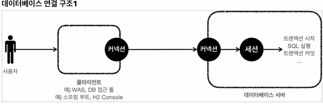

    - 사용자는 웹 애플리케이션 서버(WAS)나 DB 접근 툴 같은 클라이언트를 사용해서 데이터베이스 서버에 접근할 수 있다. 클라이언트는 데이터베이스 서버에 연결을 요청하고 커넥션을 맺게 된다. 이때 DB 서버는 내부에 세션이라는 것을 만든다.

    - 쉽게 이야기해서 개발자가 클라이언트를 통해 SQL을 전달하면 현재 커넥션에 연결된 세션이 SQL을 실행한다.
    
    - 세션은 트랜잭션을 시작하고, 커밋 또는 롤백을 통해 트랜잭션을 종료한다. 그리고 이후에 새로운 트랜잭션을 다시 시작할 수 있다.
  
    - 사용자가 커넥션을 닫거나, 또는 DBA(DB관리자)가 세션을 강제로 종료하면 세션은 종료된다.

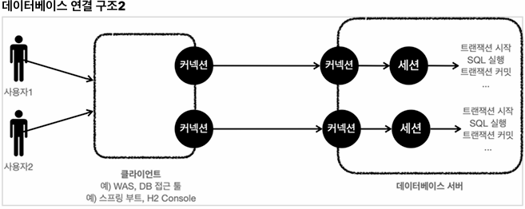    

    - 커넥션 풀이 10개의 커넥션을 생성하면, 세션도 10개 만들어진다.

### 트랜잭션 - DB 예제1 개념 이해
    ● 사용법
    - 데이터 변경 쿼리를 실행하고 데이터베이스에 그 결과를 반여하려면 커밋 명영어인 commit을 호출하고, 결과를 반영하고 싶지 않으면 롤백 명령어인 rollback을 호출하면 된다.

    - 커밋을 호출하기 전까지는 임실로 데이터를 저장하는 것이다. 따라서 해당 트랜잭션을 시작한 세션(사용자)에게만 변경 데이터가 보이고 다른 세션(사용자)에게는 변경 데이터가 보이지 않는다.
  
    - 등록, 수정, 삭제 모두 같은 원리로 동작한다. 앞으로는 등록, 수정, 삭제를 간단히 변경이라는 단어로 표현하겠다.

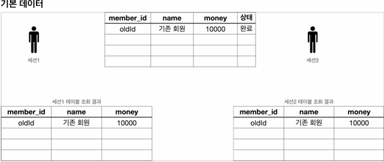

    - 세션1, 세션2 둘다 가운데 있는 기본 테이블을 조회하면 해당 데이터가 그대로 조회된다.

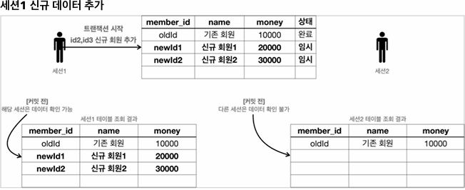 

    - 세션1은 트랜잭션을 시작하고 신규 회원1, 신규 회원2를 DB에 추가했다. 아직 커밋은 하지 않은 상태이다.
    - 새로운 데이터는 임시 상태로 저장된다.
    - 세션1은 select 쿼리를 실행해서 본인이 입력한 신규 회원1, 신규 회원2를 조회할 수 있다.
    - 세션2는 select 쿼리를 실행해도 신규 회원들을 조회할 수 없다. 왜냐하면 세션1이 아직 커밋을 하지 않았기 때문이다. 

    ● 커밋하지 않은 데이터를 다른 곳에서 조회할 수 있으면 어떤 문제가 발생할까?

      - 예를 들어서 커밋하지 않는 데이터가 보인다면, 세션2는 데이터를 조회했을 때 신규 회원1, 2가 보일 것이다. 따라서 신규 회원1, 신규 회원2가 있다고 가정하고 어떤 로직을 수행할 수 있다. 그런데 세션1이 롤백을 수행하면 신규 회원1, 신규 회원2의 데이터가 사라지게 된다. 따라서 데이터 정합성에 큰 문제가 발생한다. 

      - 세션2에서 세션1이 아직 커밋하지 않은 변경 데이터가 보인다면, 세션1이 롤백 했을 때 심각한 문제가 발생할 수 있다. 따라서 커밋 전의 데이터는 다른 세션에 보이지 않는다.

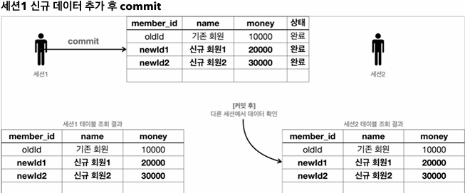       

    - 세션1이 신규 데이터를 추가한 후에 commit을 호출
    - commit으로 새로운 데이터가 실제 데이터베이스에 반영된다. 데이터의 상태도 임시 -> 완료로 변경되었다.
    - 이제 다른 세션에서도 회원 테이블을 조회하면 신규 회원들을 확인할 수 있다.

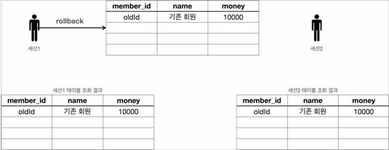 

    - 세션1이 신규 데이터를 추가한 후에 commit 대신에 rollback을 호출했다.
    - 세션1이 데이터베이스에 반영한 모든 데이터가 처음 상태로 복구된다.
    - 수정하거나 삭제한 데이터도 rollback을 호출하면 모두 트랜잭션을 시작하기 직전의 상태로 복구된다.

### 트랜잭션 - DB 예제2 자동, 수동 커밋

    ● 자동 커밋
    트랜잭션을 사용하려면 먼저 자동 커밋과 수동 커밋을 이해해야 한다.
    자동 커밋으로 설정하면 각각의 쿼리 실행 직후에 자동으로 커밋을 호출한다.
    따라서 커밋이나 롤백을 직접 호출하지 않아도 되는 편리함이 있다.
    하지만 쿼리를 하나하나 실행할 때 마다 자동으로 커밋이 되어버리기 때문에 우리가 원하는 트랜잭션 기능을 제대로 사용할 수 없다.

    - 자동 커밋 설정
    set autocommit true; // 자동 커밋 모드 설정
    insert into member(member_id, money) values ('data1', 10000); 
    insert into member(member_id, money) values ('data2', 10000);

    - 따라서 commit, rollback을 직접 호출하면서 트랜잭션 기능을 제대로 수행하려면 자동 커밋을 끄고 수동 커밋을 사용해야ㅐ 한다.

    ● 수동 커밋 설정
    set autocommit false; // 수동 커밋 모드 설정
    insert into ....
    commit; // 수동 커밋

    - 보통 자동 커밋 모드가 기본으로 설정된 경우가 많기 때문에, 수동 커밋 모드로 설정하는 것을 트랜잭션을 시작한다고 표현한다.

    - 참고로 수동 커밋 모드나 자동 커밋 모드는 한번 설정하면 해당 세션에서는 계속 유지된다. 중간에 변경하는 것은 가능하다.

### 트랜잭션 - DB 예제3 트랜잭션 실습    

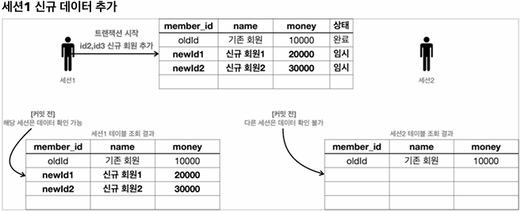

    ● 세션1 신규 데이터 추가 SQL
    // 트랜잭션 시작
    set autocommit false; // 수동 커밋 모드
    insert into member(member_id, money) values('newId1', 10000);
    insert into member(member_id, money) values('newId2', 10000);

    - 결과
    select * from member;
    세션1이 커밋을 하지 않은 상태이기 때문에 세션1에서는 입력한 데이터가 보이지만, 세션2에서는 입력한 데이터가 보이지 않는 것을 확인할 수 있다.

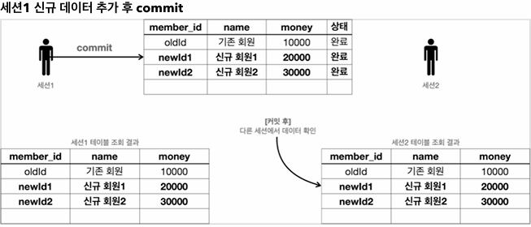;

    ● 세션1 commit 결과
    세션1이 트랜잭션을 커밋했기 때문에 데이터베이스에 실제 데이터가 반영된다.
    커밋 이후에는 모든 세션에서 데이터를 조회할 수 있다.

    ● 세션1 rollback 적용 후 결과
    롤백으로 데이터베이스에 변경 사항을 반영하지 않는다.

### 트랜잭션 - DB 에제4 계좌이체
    트랜잭션을 어떻게 사용되는지 예제를 통해 알아보자
    - 계좌이체 문제 상황 commit
    - 계좌이체 문제 상황 rollback
    
    ● 기본 데이터 입력 - SQL
    set autocommit true;
    delete from member;
    insert into member(member_id, money) values ('memberA', 10000);
    insert into member(member_id, money) values ('memberB', 10000);

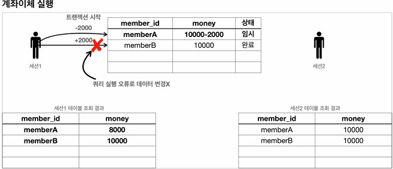

    - 계좌이체를 실행하는 도중에 SQL에 문제가 발생한다. 그래서 memberA의 돈을 2000원 줄이는 것에는 성공했지만, memberB의 돈을 2000원 증가시키는 것에 실행했다.
    - 두 번째 SQL은 member_iddd라는 필드에 오타를 설정, 두 번째 update 쿼리를 실행하면 SQL오류가 발생하는 것을 확인할 수 있다.

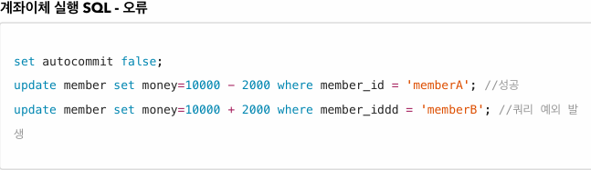    

    ● 오류 메시지
    Column "MEMBER_IDDD" not found; SQL statement;
    update member set money=10000 + 2000 where member_iddd = 'memberB'

    - 여기서 문제는 memberA의 돈은 2000원 줄어들었지만, memberB의 돈은 2000원 증가하지 않았다는 점이다. 결과적으로 계좌이체는 실패하고 memberA의 돈만 2000원 줄어든 상황이다.

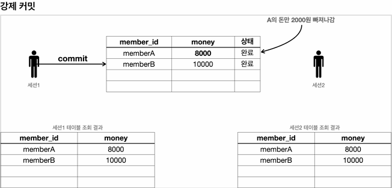    

    - 만약 이 상황에서 강제로 commit을 호출하면, 계좌이체는 실패하고 memberA의 돈만 2000원 줄어드는 문제가 발생.
    중간에 문제가 발생했을 때는 커밋을 호출하면 안된다. 롤백을 호출해서 데이터를 트랜잭션 시작 시점으로 원복해야 한다.

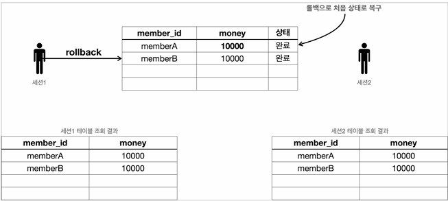    

    - 이럴 때는 롤백을 호출해서 트랙잭션을 시작하기 전 단계로 데이터를 복구해야 한다. 롤백을 사용한 덕분에 계좌이체를 실행하기 전 상태로 돌아왔다. memberA의 돈도 이전 상태인 10000원으로 돌아오고, memberB의 돈도 10000원으로 유지되는 것을 확인할 수 있다.

    ● 정리
    원자성 : 트랜잭션 내에서 실행한 작업들은 마치 하나의 작업인 것처럼 모두 성공 하거나 모두 실패해야 한다.
    트랜잭션의 원자성 덕분에 여러 SQL 명령어를 마치 하나의 작업인 것 처럼 처리할 수 있었다. 성공하면 한번에 반영하고, 중간에 실패해도 마치 하나의 작업을 되돌리는 것 처럼 간단히 되돌릴 수 있다.

    ● auto commit
    만약 오토 커밋 모드로 동작하는데, 계좌이체 중간에 실패하면, 쿼리를 하나 실행할 때 마다 바로바로 커밋이 되어버리기 때문에 memberA의 돈만 2000원 줄어드는 심각한 문제가 발생한다.

    ● transaction 시작
    따라서 이런 종류의 작업은 꼭 수동 커밋 모드를 사용해서 수동으로 커밋, 롤백 할 수 있도록 해야 한다. 보통 이렇게 자동 커밋 모드에서 수동 커밋 모드로 전환 하는 것을 트랜잭션을 시작한다고 표현한다.

### DB 락 - 개념 이해
    - 세션1이 트랜잭션을 시작하고 데이터를 수정하는 동안 아직 커밋을 수행하지 않았는데, 세션2에서 동시에 같은 데이터를 수정하게 되면 여러가지 문제가 발생한다. 바로 트랜잭션의 원자성이 깨지는 것이다. 여기에 더해서 세션1이 중간에 롤백을 하게 되면 세션2는 잘못된 데이터를 수정하는 문제가 발생한다.    

    - 이런 문제를 방지하려면, 세션이 트랜잭션을 시작하고 데이터를 수정하는 동안에는 커밋이나 롤백 전까지 다른 세션에서 해당 데이터를 수정할 수 없게 막아야 한다.
  
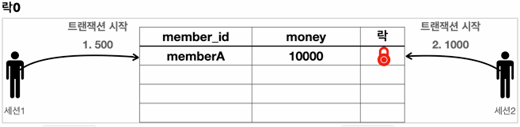

    - 세션1은 memberA의 금액을 500원으로 변경하고 싶고, 세션2는 같은 memberA의 금액을 1000원으로 변경하고 싶다.
    - 데이터베이스는 이런 문제를 해결하기 위해 lock이라는 개념을 제공한다.
    - 다음 예시를 통해 동시에 데이터를 수정하는 문제를 lock으로 어떻게 해결하는지 자세히 알아보자.

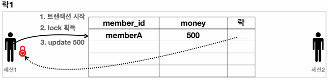    

    1) 세션1은 트랜잭션을 시작한다.
    2) 세션1은 memberA의 money를 500원으로 변경을 시도한다. 이때 해당 로우의 lock을 먼저 획득해야 한다. 락이 남아 있으므로 세션1은 락을 획득한다.(세션1이 세션2보다 조금 더 빨리 요청했다.) 
    3) 세션1은 lock을 획득했으므로 해당 로우에 update sql을 실행한다.

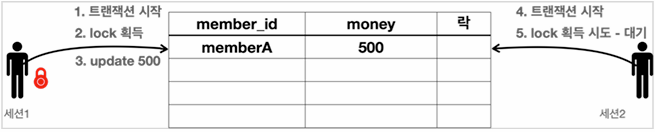    

    4) 세션2는 트랜잭션을 시작한다.
    5) 세션2도 memberA의 money 데이터를 변경하려고 시도한다. 이때 해당 로우의 lock을 먼저 획득해야 한다. 락이 없으므로 lock이 돌아올 때 까지 대기한다.

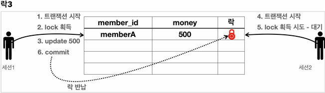 

    6) 세션1은 커밋을 수행한다. 커밋으로 트랜잭션이 종료되었으므로 락도 반납한다.

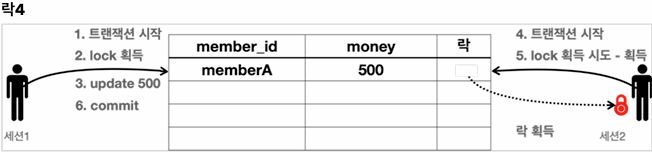     

    - lock을 획득하기 위해 대기하던 세션2가 lock을 획득한다.
  
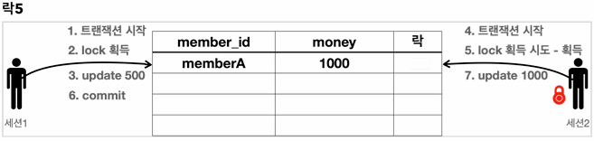 

    7) 세션2는 update sql을 수행한다.

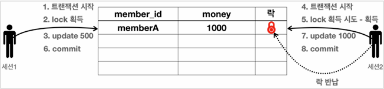   

    8) 세션2는 커밋을 수행하고 트랜잭션이 종료되었으므로 락을 반납한다.

### DB lock - 변경

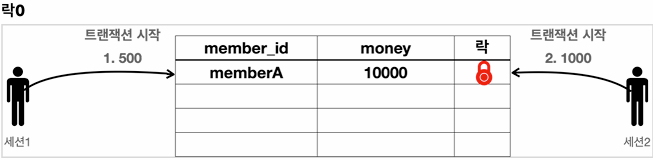

    ● 기본 데이터 입력 - SQL
    set autocommit true;
    delete from member;
    insert into member(member_id, money) values ('memberA', 10000);

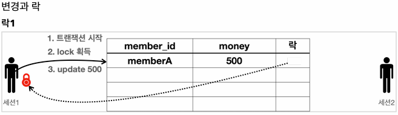    

    ● 세션1
    set autocommit false;
    update member set money=500 where member_id = 'memberA';

    - 세션1이 트랜잭션을 시작하고 memberA의 데이터를 500원으로 업데이트 했다. 아직 커밋은 하지 않았다. 
    - memberA 로우의 락은 세션1이 가지게 된다.

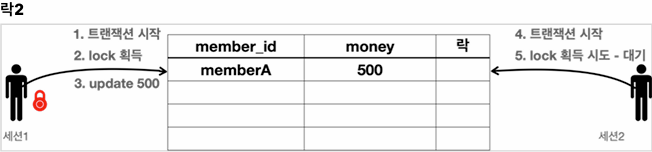

    - 세션2는 memberA의 데이터를 1000원으로 수정하려 한다.
    - 세션1이 트랜잭션을 커밋하거나 롤백해서 종료하지 않았으므로 아직 세션1이 lock을 가지고 있다. 따라서 세션2는 lock을 획득하지 못하기 때문에 데이터를 수정할 수 없다. 세션2는 lock이 돌아올 때 가지 대기하게 된다.
    - SET_LOCK_TIMEOUT 60000 : lock 획득 시간을 60초 안에 lock을 얻지 못하면 예외가 발생한다.

    ● 세션2 lock 획득
    세션1을 커밋하면 세션1이 커밋되면서 lock을 반납한다. 이후에 대기하던 세션2가 lock을 획득하게 된다. 따라서 lock을 획득한 세션2의 업데이트가 반영되는 것을 확인할 수 있다. 물론 이후에 세션2도 커밋을 호출해서 lock을 반납해야 한다.

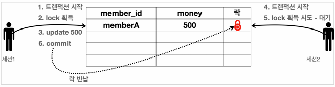

    - 세션1은 커밋을 수행한다. 커밋으로 트랜잭션이 종료되었으므로 lock도 반납한다.

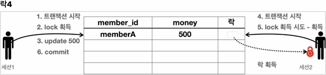

    - lock을 획득하기 위해 대기하던 세션2가 lock을 획득한다.
  
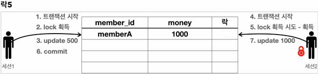

    - 세션2는 update sql을 정상 수행한다.

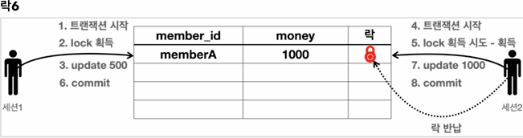

    - 세션2는 커밋을 수행하고 트랜잭션이 종료되었으므로 lock을 반납한다.

    ● 세션2 lock timeout
    - SET_LOCK_TIMEOUT <milliseconds> lock 타임아웃 시간을 설정한다.
        
        ex) SET LOCK_TIMEOUT 10000 10초, 세션2에 설정하면 세션2가 10초 동안 대기해도 lock을 얻지 못하면 lock 타임아웃 오류가 발생한다.

        ex) 위 시나리오 중간에 lock을 오랜기간 대기하면 다음과 같은 lock 타임아웃 오류가 발생한다.

            - 세션2의 실행 겨로가
            timeout trying to lock {0}; SQL statement:
            update memebr set money=10000 - 2000 where member_id = 'memberA' 
            
            - 세션1이 memberA의 데이터를 변경하고, 트랜잭션을 아직 커밋하지 않았다. 따라서 세션2는 세션1이 트랜잭션을 커밋하거나 롤백할 때 까지 대기해야 한다. 기다리면 lock 타임아웃 오류가 발생하는 것을 확인할 수 있다.

###  DB lock - 조회
    일반적인 조회는 lock을 사용하지 않는다.
    - 데이터베이스마다 다르지만, 보통 데이터를 조회할 때는 lock을 획득하지 않고 바로 데이터를 조회할 수 있다.
    
    - 예를 들어서 세션1이 lock을 획득하고 데이터를 변경하고 있어도, 세션2에서 데이터를 조회는 할 수 있따. 물론 세션2에서 조회가 아니라 데이터를 변경하려면 lock이 필요하기 때문에 lock이 돌아올 때 까지 대기해야 한다.

    ● 조회와 lock
    - 데이터를 조회할 때도 lock을 획득하고 싶을 때가 있다. 이럴 때는 select for update 구문을 사용하면 된다.
    - 이렇게 하면 세션1이 조회 시점에 lock을 가져가버리기 때문에 다른 세션에서 해당 데이터를 변경할 수 없다.
    - 물론 이 경우도 트랜잭션을 커밋하면 lock을 반납한다.   

    ● 조회 시점에 lock이 필요한 경우는 언제일까?
    - 트랜잭션 종료 시점까지 해당 데이터를 다른 곳에서 변경하지 못하도록 강제로 막아야 할 때 사용한다.

    ex) 애플리케이션 로직에서 memberA의 금액을 조회한 다음에 이 금액 정보로 애플리케이션에서 어떤 계산을 수행한다. 그런데 이 계산이 돈과 관련되 매우 중요한 계산이어서 계산을 완료할 때 까지 memberA의 금액을 다른곳에서 변경하면 안된다. 이럴 때 조회 시점에 lock을 획득하면 된다.

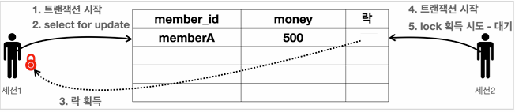             

    ● 세션1
    set autocommit false;
    select * from member where member_id='memberA' for udpate;

      - select for update 구문을 사용하려면 조회를 하면서 동시에 선택한 로우의 lock도 획득한다.
        - 물론 lock이 없다면 lock을 획들할 때 까지 대기해야 한다.
      - 세션1은 트랜잭션을 종료할 때 까지 memberA의 로우의 lock을 보유한다.

    ● 세션2
    set autocommit false;
    update member set money=500 where member_id = 'memberA';

        - 세션2는 데이터를 변겨앟고 싶다. 데이터를 변경하려면 lock이 필요하다.
        - 세션1이 memberA 로우의 lock을 획득했기 때문에 세션2는 lock을 획득할 때 까지 대기한다.
        - 이후에 세션1이 커밋을 수행하면 세션2가 lock을 획득하고 데이터를 변경한다. 만약 lock 타임아웃 시간이 지나면 lock 타임아웃 예외가 발생한다.  
    
### 트랜잭션 - 적용1
    - 실제 애플리케이션에서 DB 트랜잭션을 사용해서 계좌이체 같이 원자성이 중요한 비즈니스 로직을 어떻게 구현하는지 알아보자
    
    ● MemberServiceV1
    @RequiredArgsConstructor
    public class MemberServiceV1 {

        private final MemberRepositoryV1 memberRepository;
        
        public void accountTransfer(String fromId, String toId, int money) throws SQLException {

            Member fromMember = memberRepository.findById(fromId);
            Member toMember = memberRepository.findById(toId);

            memberRepository.update(fromId, fromMember.getMoney() - money);
            validation(toMember);
            memberRepository.update(toId, toMember.getMoney() + money);
        }

        private void vlidation(Member toMember) {
            if (toMember.getMemberId().equals("ex")) {
                throw new IllegalStateException("이체중 예외 발생");
            }
        }
    }
    - fromId의 회원을 조회해서 toId의 회원에게 money 만큼의 돈을 계좌이체 하는 로직이다.
      - fromId 회원의 돈을 money 만큼 감소한다. -> UPDATE SQL 실행
      - toId 회원의 돈을 money 만큼 증가한다. -> UPDATE SQL 실행
    - 예외 상황을 테스트해보기 위해 toId가 "ex"인 경우 예외를 발생한다.

    ● MemberServiceV1Test
    /**
     *  기본 동작, 트랜잭션이 없어서 문제 발생
     */
    class MemberServiceV1Test {

        public static final String MEMBER_A = "memberA";
        public static final String MEMBER_B = "memberB";
        public static final String MEMBER_EX = "ex";

        private MemberRepositoryV1 memberRepository;
        private MemberServicveV1 memberService;

        @BeforeEach
        vodi before() {
            DriverManagerDataSource dataSource = new DirverManagerDataSource(URL, USERNAME, PASSWORD);
            memberRepository = new MemberRepositoryV1(dataSource);
            memberService = new MemberServiceV1(memberRepository);
        }

        @AfterEach
        void after() throws SQLException {
            memberRepository.delete(MEMBER_A);
            memberRepository.delete(MEMBER_B);
            memberRepository.delete(MEMBER_EX);
        }

        @Test
        @DisplayName("정상 이체");
        void accountTransfer() throws SQLException {
            // given
            Member memberA = new Member(MEMBER_A, 10000);
            Member memberA = new Member(MEMBER_B, 10000);
            memberRepository.save(memberA);
            memberRepository.save(memberB);

            // when
            memberService.accountTransfer(memberA.getMemberId(),
            memberB.getMemberId(), 2000);

            // then
            Member findMemberA = memberRepository.findById(memberA.getMemberId());
            Member findMemberB = memberRepository.findById(memberB.getMemberId());
            assertThat(findMemberA.getMoney()).isEqualTo(8000);
            assertThat(findMemberB.getMoney()).isEqualTo(12000);
        }

        @Test
        @DisplayName("이체중 예외 발생")
        void accountTransferEx() throws SQLException {
            // given
            Member memberA = new Member(MEMBER_A, 10000);
            Member memberB = new Member(MEMBER_EX, 10000);
            memberRepository.save(memberA);
            memebrRepository.save(memberEX);

            // when
            assertThatThrownBy(() -> memberService.accountTransfer(memberA.getMemberId(), memberEx.getMemberId(), 2000)).isInstanceOf(IllegalStateException.class);

            // then
            Member findMemberA = memberRepository.findById(memberA.getMemberId());
            Member findMemberEX = memberRepository.findById(memberEx.getMemberId());

            // memberA의 돈만 2000원 줄었고, ex의 돈은 10000원 그대로이다.
            assertThat(findMemberA.getMoney()).isEqualTo(8000);
            assertThat(findMemberEx.getMoney()).isEqualTo(10000);
        }
    } 

    - 주의! 테스트를 수행하기 전에 데이터베이스의 데이터를 삭제해야 한다.
        delete from member;

    ● 정상 이체 - accountTransfer()
    - given : 다음 데이터를 저장해서 테스트를 준비한다.
      - memberA 10000원
      - memberB 10000원
    - when : 계좌이체 로직을 실행한다.
      - memberService.accountTransfer()를 실행한다.
      - memberA -> memberB로 2000원 계좌이체 한다.
        - memberA의 금액이 2000원 감소한다.
        - memberB의 금액이 2000원 증가한다.
    - then : 계좌이체가 정상 수행되었는지 검증한다.
      - memberA 8000원 - 2000원 감소
      - memberB 12000원 - 2000원 증가

    ● 테스트 데이터 제거
    테스트가 끝나면 다음 테스트에 영향을 주지 않기 위해 @AfterEach에서 테스트에 사용한 데이터를 모두 삭제한다.
        - @BeforeEach : 각각의 테스트가 수행되기 전에 실행된다.
        - @AfterEach : 각각의 테스트가 수행된 후에 실행된다. 

    @AfterEach
    void after() throws SQLException {
        memberRepository.delete(MEMBER_A);
        memberRepository.delete(MEMBER_B);
        memberRepository.delete(MEMBER_EX);
    }        
    - 테스트 데이터를 제거하는 과정이 불편하지만, 다음 테스트에 영향을 주지 않으려면 테스트에서 사용한 데이터를 모두 제거해야 한다. 그렇지 않으면 이번 테스트에서 사용한 데이터 때문에 다음 테스트에서 데이터 중복으로 오류가 발생할 수 있다.
    
    - 테스트에서 사용한 데이터를 제거하는 더 나은 방법으로는 트랜잭션을 활용하면 된다. 테스트 전에 트랜잭션을 시작하고, 테스트 이후에 트랜잭션을 롤백해버리면 데이터가 처음 상태로 돌아온다. 
    
    ● 이체중 예외 발생 - accountTransferEx()
    - given : 다음 데이터를 저장해서 테스트를 준비한다.
      - memberA : 10000원
      - memberB : 10000원
    - when : 계좌이체 로직을 실행한다.
      - memberService.accountTransfer() 를 실행.
      - memberA -> memberEx로 2000원 계좌이체 한다.
        - memberA의 금액이 2000원 감소한다.
        - memberEx 회원의 ID는 ex이므로 중간에 예외가 발생한다. (매우 중요)
    - then : 계좌이체는 실패한다. memberA의 돈만 2000원 줄어든다.
      - memberA 8000원 - 2000원 감소
      - memberEx 10000원 - 중간에 실패로 로직이 수행되지 않았다. 따라서 그대로 10000원으로 남아있게 된다.

    ● 정리
    이체중 예외가 발생하게 되면 memberA의 금액은 10000원 -> 8000원으로 2000원 감소한다. 그런데 memberEx의 돈은 그대로 10000원으로 남아있다. 결과적으로 memberA의 돈만 2000원 감소한 것이다.

### 트랜잭션 - 적용2
    - 이번에는 DB 트랜잭션을 사용해서 앞서 발생한 문제점을 해결해보자
    - 애플리케이션에서 트랜잭션을 어떤 계층에 걸어야 할까? 쉽게 이야기해서 트랜잭션을 어디에서 시작하고, 어디에서 커밋해야 할까?

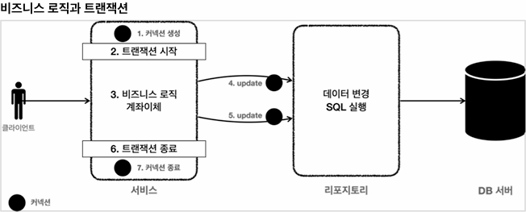

    - 트랜잭션은 비즈니스 로직이 있는 서비스 계층에서 시작해야 한다. 비즈니스 로직이 잘못되면 해당 비즈니스 로직으로 인해 문제가 되는 부분은 함께 롤백해야 하기 때문이다.

    - 그런데 트랜잭션을 시작하려면 커넥션이 필요하다. 결국 서비스 계층에서 커넥션을 만들고, 트랜잭션 커밋 이후에 커넥션을 종료해야 한다.

    - 애플리케이션에서 DB 트랜잭션을 사용하려면 트랜잭션을 사용하는 동아 같은 커넥션을 유지해야 한다. 그래야 같은 세션을 사용할 수 있다.

    - 애플리케이션에서 같은 커넥션을 유지하려면 어떻게 해야할까? 가장 단순한 방법은 커넥션을 파라미터로 전달해서 같은 커넥션이 사용되도록 유지하는 것이다.

    ● MemberRepositoryV2(add parameter)
    /**
     *  JDBC - ConnectionParam
     */
    @Slf4j
    @RequiredArgConstructor
    public class MemberRepositoryV2 {

        private final DataSource dataSource;

        public Member save(Member member) throws SQLException {
            String sql = "insert into member(member_id, money) values(?, ?)";

            Connection con = null;
            PrepareedStatement pstmt = null;

            try {
                con = getConnection();
                pstmt = con.prepareStatement(sql);
                pstmt.setString(1, member.getMemberId());
                pstmt.setInt(2, member.getMoney());
                pstmt.executeUpdate();
                return member;
            } catch (SQLException e) {
                log.error("db error", e);
                return e;
            } finally {
                close(con, pstmt, null);
            }
        }

        public Member findById(String memberId) throws SQLException {
            String sql = "select * from member where member_id = ?";

            Connection con = null;
            PreparedStatement pstmt = null;
            ResultSet rs = null;

            try {
                con = getConnection();
                pstmt = con.prepareStatement(sql);
                pstmt.setString(1, memberId);

                rs = pstmt.executeQuery();

                if (rs.next()) {
                    Member member = new Member();
                    member.setMemberId(rs.getString("member_id"));
                    member.setMoney(rs.getInt('money'));
                    return member;
                } else {
                    throw new NoSuchElementException("member no found memberId=" + memberId);
                }
            } catch (SQLException e) {
                log.error("db error", e);
                throw e;
            } finally {
                close(con, pstmt, rs);
            }
        }

        public Member findById(Connection con, String memberId) throws SQLException {
            String sql = "select * from member where member_id = ?";

            PreparedStatement pstmt = null;

            ResultSet rs = null;

            try {
                pstmt = con.prepareStatement(sql);
                pstmt.setString(1, memberId);

                rs = pstmt.executeQuery();

                if (rs.next()) {
                    Member member = new Member();
                    member.setMemberId(rs.getString("member_id"));
                    member.setMoney(rs.getInt("money));
                    return member;
                } else {
                    throw new NoSuchElementException("member not found memberId=" + memberId);
                }
            } catch (SQLException e) {
                log.error("db error", e);
                throw e;
            } finally {
                // connection은 여기서 닫지 않는다.
                JdbcUtils.closeResultSet(rs);
                JdbcUtils.closeStatement(pstmt);
            }
        }

        public void update(Connection con, String memberId, int money) throws SQLException {
            String sql = "update member set money=? where member_id=?";

            PreparedStatement pstmt = null;

            try {
                pstmt = con.prepareStatement(sql);
                pstmt.setInt(1, money);
                pstmt.setString(2, memberId);
                pstmt.executeUpdate();

            } catch (SQLException e) {
                log.error("db error", e);
                throw e;
            } finally {
                // connection은 여기서 닫지 않는다.
                JdbcUtils.closeStatement(pstmt);
            }
        }

        public void delete(String memberId) throws SQLException {

            String sql = "delete from member where member_id=?";

            Connection con = null;
            PreparedStatement pstmt = null;

            try {
                con = getConnection();
                pstmt = con.prepareStatement(sql);
                pstmt.setString(1, memberId);

                pstmt.executeUpdate();

            } catch (SQLException e) {
                log.error("db error", e);
                throw e;
            } finally {
                close(con, pstmt, null);
            }
        }

        private void close(Connection con, Statement stmt, ResultSet rs) {
            JdbcUtils.closeResultSet(rs);
            JdbcUtils.closeStatement(stmt);
            JdbcUtils.closeConnection(con);
        }

        private Connection getConnection() throws SQLException {
            Connection con = dataSource.getConnection();
            log.info("get connection={} class={}", con, con.getClass());
            return con;
        }
    }

    - MemberRepositoryV2는 기존 코드와 같고 커넥션 유지가 필요한 다음 두 메서드가 추가되었다. 참고로 다음 두 메서드는 계좌이체 서비스 로직에서 호출하는 메서드이다.
    - findById(Connection con, String memberId);
    - update(Connection con, String memberId, int money);

    ● 1. 커넥션 유지가 필요한 두 메서드는 파라미터로 넘어온 커넥션을 사용해야 한다. 따라서 con = getConnection() 코드가 있으면 안된다.

    ● 2. 커넥션 유지가 필요한 두 메서드는 리포지토리에서 커넥션을 닫으면 안된다. 커넥션을 전달 받은 리포지토리 뿐만 아니라 이후에도 커넥션을 계속 이어서 사용하기 때문이다. 이후 서비스 로직이 끝날 때 트랜잭션을 종료하고 닫아야 한다.

    ● MemberServiceV2 (커넥션 유지)
    /**
     *  트랜잭션 - 파라미터 연동, 풀을 고려한 종료
     */
    @Slf4j
    @RequiredArgsConstructor
    public class MemberServiceV2 {

        private final DataSource dataSource;
        private final MemberRepositoryV2 memberRepository;

        public void accountTransfer(String fromId, String toId, int money) throws SQLException {

            Connection con = dataSource.getConnection();

            try {
                con.setAutoCommit(false); // 트랜잭션 시작
                // 비즈니스 로직
                bizLogic(con, fromId, toId, money);
                con.commit(); // 성공시 커밋
            } catch (Exception e) {
                con.rollback(); // 실패시 롤백
                throw new IllegalStateException(e);
            } finally {
                release(con);
            }
        }
    } 

    private void bizLogic(Connection con, String fromId, String toId, int money) throws SQLException {
        Member fromMember = memberRepository.findById(con, fromId);
        Member toMember = memberRepository.findById(con, toId);

        memberRepository.update(con, fromId, fromMember.getMoney() - money);
        validation(toMember);
        memberRepository.update(con, toId, toMember.getMoney() + money);
    }

    private void validation(Member toMember) {
        if (toMember.getMemberId().equals("ex")) {
            throw new IllegalStateException("이체중 예외 발생");
        }
    }

    private void release(Connection con) {
        if (con != null) {
            try {
                con.setAutoCommit(true); // 커넥션 풀 고려
                con.close();
            } catch (Exception e) {
                log.info("error", e);
            }
        }
    }

    - Connection con = dataSource.getConnection();
      - 트랜잭션을 시작하려면 커넥션이 필요하다.
      
    - con.setAutoCommit(false); // 트랜잭션 시작
      - 트랜잭션을 시작하려면 자동 커밋 모드를 꺼야한다. 이렇게 하면 커넥션을 통해 세션에 set autocommit false가 전달되고, 이후부터는 수동 커밋 모드로 동작한다. 이렇게 자동 커밋 모드를 수동 커밋 모드로 변경하는 것을 트랜잭션을 시작한다고 보ㅓㅗㅓㅗㅗㅓㅗㅓㅓ통 표현한다.

    - bizLogic(con, fromId, toId, money);
      - 트랜잭션이 시작된 커넥션을 전달하면서 비즈니스 로직을 수행한다.
      - 이렇게 분리한 이유는 트랜잭션을 관리하는 로직과 실제 비즈니스 로직을 구분하기 위함이다.
      - memberRepository.update(con..) : 비즈니스 로직을 보면 리포지토리를 호출할 때 커넥션을 전달하는 것을 확인할 수 있다.

    - con.commit(); // 성공시 커밋
      - 비즈니스 로직이 정상 수행되면 트랜잭션을 커밋한다.

    - con.rollback(); // 실패시 롤백
      - catch(Ex){...}를 사용해서 비즈니스 로직 수행 도중에 예외가 발생하면 트랜잭션을 롤백한다.
      
    - release(con);
      - finally{...}를 사용해서 커넥션을 모두 사용하고 나면 안전하게 종료한다. 그런데 커넥션 풀을 사용하면 con.close()를 호출 했을 때 커넥션이 종료되는 것이 아니라 풀에 반납된다. 현재 수동 커밋모드로 동작하기 때문에 풀에 돌려주기 전에 기본 값인 자동 모드로 변경하는 것이 안전하다.

    ● 남은 문제
    테스트 직후 트랜잭션 덕분에 계좌이체가 실패할 때 롤백을 수행해서 모든 데이터를 정상적으로 초기화 할 수 있게 되었다. 결과적으로 계좌이체를 수행하기 직전으로 돌아가게 된다.

    그러나 애플리케이션 DB 트랜잭션을 적용하려면 서비스 계층이 매우 지저분해지고, 생각보다 매우 복잡한 코드를 요구한다. 추가로 커넥션을 유지하도록 코드를 변경하는 것도 쉬운 일은 아니다. 다음 시간에는 스프링을 사용해서 이런 문제들을 하나씩 해결해보자.

    
    