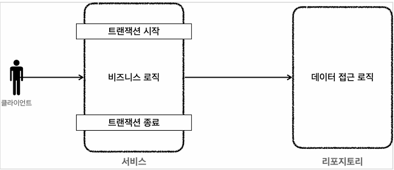

## 본문

### transaction - 문제점

    ● 순수한 서비스 계층
    - 핵심 비즈니스 로직이 들어있는 서비스 계층이 핵심 계층이다. 시간이 흘러서 UI(웹)와 관련도니 부분이 변하고, 데이터 저장 기술을 다른 기술로 변경해도, 비즈니스 로직은 최대한 변경없이 유지되어야 한다.
  
    - 이렇게 하려면 서비스 계층을 특정 기술에 종속하지 않게 개발해야 한다.
      - 이렇게 계층을 나눈 이유도 서비스 계층을 최대한 순수하게 유지하기 위한 목적이 크다. 기술에 종속적인 부분은 프레젠테이션 계층, 데이터 접근 계층에서 가지고 간다.

      - 프레젠테이션 계층은 클라이언트가 접근하는 UI와 관련된 기술인 웹, 서블릿, HTTP와 관련된 부분을 담당해준다. 그래서 서비스 계층을 이런 UI와 관련된 기술로부터 보호해준다. 예를 들어서 HTTP API를 사용하다가 GRPC 같은 기술로 변경해도 프레젠테이션 계층의 코드만 변경하고, 서비스 계층은 변경하지 않아도 된다.

      - 데이터 접근 계층은 데이터를 저장하고 관리하는 기술을 담당해준다. 그래서 JDBC, JPA와 같은 구체적인 데이터 접근 기술로부터 서비스 계층을 보호해준다. 예를 들어서 JDBC를 사용하다가 JPA로 변경해도 서비스 계층은 변경하지 않아도 된다. 물론 서비스 계층에서 데이터 접근 계층을 직접 접근하는 것이 아니라, 인터페이스를 제공하고 서비스 계층은 이 인터페이스에 의존하는 것이 좋다. 그래야 서비스 코드의 변경 없이 JdbcRepository를 JpaRepository로 변경할 수 있다.

    - 서비스 계층이 특정 기술에 종속되지 않기 때문에 비즈니스 로직을 유지보수 하기 쉽고, 테스트 하기도 쉽다.
    
    ● 정리
    - 서비스 계층은 가급적 비즈니스 로직만 구현하고 특정 구현 기술에 직접 의존해서는 안된다. 이렇게 하면 향후 구현 기술이 변경될 때 변경의 영향 범위를 최소화 할 수 있다.

### MemberServiceV1
    @RequiredArgsConstructor
    public class MemberServiceV1 {

        private final MemberRepositoryV1 memberRepository;

        public void accountTransfer(String fromId, String toId, int money) throws SQLException {
            Member formMember = memberRepository.update(fromId); 
            member toMember = memberRepository.findById(toId);

            memberRepository.update(fromId, fromMember.getMoney() - money);
            memberRepository.update(toId, toMember.getMoney() + money);
        }
    }
    - MemberServiceV1은 특정 기술에 종속적이지 않고, 순수한 비즈니스 로직만 존재한다.
    - 특정 기술과 관련된 코드가 거의 없어서 코드가 깔끔하고, 유지보수 하기 쉾다.
    - 향후 비즈니스 로직의 변경이 필요하면 이 부분 변경하면 된다.

    사실 여기에도 남은 문제가 있다.
    - SQLException이라는 JDBC 기술에 의존한다는 점이다.
    - 이 부분은 memberRepository에서 올라오는 예외이기 때문에 memberRepository에서 해결해야 한다. 이 부분은 뒤에서 다룰 떄 알아보자.
    - MemberRepositoryV1 이라는 구체 클래스에 직접 의존하고 있다. MemberRepository 인터페이스를 도입하면 향후 MemberService의 코드의 변경 없이 다른 구현 기술로 손쉽게 변경할 수 있다.

### MemberServiceV2
    @Slf4j
    @RequiredArgsConstructor
    public class MemberServiceV2 {

        private final DataSource dataSource;
        private final MemberReposiotryV2 memberRepository;

        public void accountTransfer(Sring fromId, String toId, int money) thorws SQLException {
            Connection con = dataSource.getConnection();
            try {
                con.setAutoCommit(false); // 트랜잭션 시작
                // 비즈니스 로직
                bizLogic(con, fromId, toId, money);
                con.commit(); // 성공시 커밋
            } catch (Exception e) {
                con.rollback(); // 실패시 롤백
                throw new IllegalStateException(e);
            } finally {
                release(con);
            }
        }

        private void bizLogic(Connection con, String fromId, String toId, int money) throws SQLException {
            Member fromMember = memberRepository.findById(con, fromId);
            Member toMember = memberRepository.findById(con, toid);

            memberRepository.update(con, fromId, fromMember.getMoney() - money);
            memberRepository.update(con, toId, fromMember.getMoney + money);
        }
    }
    - 트랜잭션은 비즈니스 로직이 있는 서비스 계층에서 시작하는 것이 좋다.
    - 그런데 문제는 트랜잭션을 사용하기 위해서 javax.sql.DataSource, java.sql.Connection, java.sql.SQLException 같은 JDBC 기술에 의존해야 한다는 점이다.
    - 트랜잭션을 사용하기 위해 JDBC 기술에 의존한다. 결과적으로 비즈니스 로직보다 JDBC를 사용해서 트랜잭션을 처리하는 코드가 더 많다.
    - 향후 JDBC에서 JPA 같은 다른 기술로 바꾸어 사용하게 되면 서비스 모두 함께 변경해야 한다.(JPA는 트랜잭션을 사용하는 코드가 JDBC와 다르다.)
    - 핵심 비즈니스 로직과 JDBC 기술이 섞여 있어서 유지보수 하기 어렵다.

    ● 문제 정리
    1) 트랜잭션 문제
    2) 예외 누수 문제
    3) JDBC 반복 문제

    - JDBC 구현 기술이 서비스 계층에 누수되는 문제
        - 서비스 계층은 순수해야 한다. -> 구현 기술을 변경해도 서비스 계층 코드는 최대한 유지할 수 있어야 한다.(변화에 대응)
          - 그래서 데이터 접근 계층에 JDBC 코드를 다 몰아두는 것이다.
          - 물론 데이터 접근 계층의 구현 기술이 변경될 수도 있으니 데이터 접근 계층은 인터페이스를 제공하는 것이 좋다.
        - 서비스 계층은 특정 기술에 종속되지 않아야 한다. 지금까지 그렇게 노력해서 데이터 접근 계층으로 JDBC 관련 코드를 모았는데, 트랜잭션을 적용하면서 결국 서비스 계층에 JDBC 구현 기술의 누수가 발생했다.

    - 트랜잭션 동기화 문제
      - 같은 트랜잭션을 유지하기 위해 커넥션을 파라미터로 넘겨야 한다.
      - 이때 파생되는 문제들도 있다. 똑같은 기능도 트랜잭션용 기능과 트랜잭션을 유지하지 않아도 되는 기능으로 분리해야 한다.
    - 트랜잭셔 적용 반복 문제
      - 트랜잭션 적용 코드를 보면 반복이 많다. try, catch, finally....

    ● 예외 누수
    - 데이터 접근계층의 JDBC 구현 기술 예외가 서비스 계층으로 전파된다.
    - SQLException은 체크 예외이기 때문에 접근 계층을 호출한 서비스 계층에ㅓ서 해당 예외를 잡아서 처리하거나 명시적으로 throws를 통해서 다시 밖으로 던져야한다.
    - SQLException은 JDBC 전용 기술이다. 향후 JPA나 다른 데이터 접근 기술을 사용하면, 그에 맞는 다른 예외로 변경해야 하고, 결국 서비스 코드도 수정해야 한다.

    ● JDBC 반복 문제
    - 지금까지 작성한 MemberRepository 코드는 순수한 JDBC를 사용했따.
    - 이 코드들은 유사한 코드의 반복이 너무 많다.
      - try, catch, finally...
      - 커넥션을 열고, PreparedStatement를 사용하고, 결과를 매핑하고.... 실행하고, 커넥션과 리소스를 정리한다.

### 트랜잭션 추상화
    현재 서비스 계층은 트랜잭션을 사용하기 위해서 JDBC 기술에 의존하고 있따. 향후 JDBC에서 JPA 같은 다른 데이터 접근 기술로 변경하면, 서비스 계층의 트랜잭션 관련 코드도 모두 함께 수정해야 한다.

    ● 구현 기술에 따른 트랜잭션 사용법
    - 트랜잭션은 원자적 단위의 비즈니스 로직을 처리하기 위해 사용한다.
    - 구현 기술마다 트랜잭션을 사용하는 방법이 다르다.
      - JDBC : con.setAutoCommit(false)             
      - JAP : transaction.begin()

    ● JDBC 트랜잭션 코드 예시
    public void accountTransfer(String fromId, String toId, int money) throws SQLException {
        Connection con = dataSource.getConnection();
        try {
            con.setAutoCommit(false); // 트랜잭션 시작
            // 비즈니스 로직
            bizLogic(con, fromId, toId, money);
            con.commit(); // 성공시 커밋
        } catch (Exception e) {
            con.rollback(); // 실패시 롤백
            throws new IllegalStateException(e);
        } finally {
            release(con);
        }
    }

    ● JPA 트랜잭션 코드 예시
    public static void main(String[] args) {
        
        // 엔티티 매니저 팩토리 생성
        EntityManagerFactory emf = Persistence.createEntityManagerFactory("jpabook");
        EntityManager em = emf.createEntityManager(); // 엔티티 매니저 생성
        EntityTransaction tx = em.getTransaction(); // 트랜잭션 기능 획득

        try {
            tx.begin(); // 트랜잭션 시작
            logic(em);  // 비즈니스 로직
            tx.commit();// 트랜잭션 커밋              
        } catch (Exception e) {
            tx.rollback(); // 트랜잭션 롤백
        } finally {
            em.close(); // 앤티티 매니저 종료
        }
        emf.close(); // 앤티티 매니저 팩토리 종료
    }
    
    ● 정리
    트랜잭션을 사용하는 코드는 데이터 접근 기술마다 다르다. 만약 다음 그림과 같이 JDBC 기술을 사용하고, JDBC 트랜잭션에 의존하다가 JPA 기술로 변경하게 되면 서비스 계층의 트랜잭션을 처리하는 코드도 모두 함께 변경해야 한다.

    

    - 이렇게 JDBC 기술을 사용하다가 JPA 기술로 변경하게 되면 서비스 계층의 코드도 JPA 기술을 사용하도록 함께 수정해야 한다.

    ● 트랜잭션 추상화 인터페이스
    public interface TxManager {
        begin();
        commit();
        rollback();
    }

    - 트랜잭션은 사실 단순하다. 트랜잭션을 시작하고, 비즈니스 로직의 수행이 끝나면 커밋하거나 롤백하면 된다.

    - 그리고 다음과 같이 TxManager 인터페이스를 기반으로 각각의 기술에 맞는 구현체를 만들면 된다.
      - Jdbc TxManager : JDBC 트랜잭션 기능을 제공하는 구현체
      - JpaTxManager : JPA 트랜잭션 기능을 제공하는 구현체
    

    - 서비스는 특정 트랜잭션 기술에 직접 의존하는 것이 아니라, TxManager 라는 추상화된 인터페이스에 의존한다. 이제 원하는 구현체를 DI를 통해서 주입하면 된다. 
    예를 들어서 JDBC 트랜잭션 기능이 필요하면 JdbcTxManager 를 서비스에 주입하고, JPA 트랜잭션 기능으로 변경해야 하면 JpaTxManager 를 주입하면 된다. 

    ● 스프링의 트랜잭션 추상화
    스프링은 이미 이런 고민을 다 해두었다. 우리는 스프링이 제공하는 트랜잭션 추상화 기술을 사용하면 된다. 심지어 데이터 접근 기술에 따른 트랜잭션 구현체도 대부분 만들어두어서 가져다 사용하기만 하면 된다.

    - 스프링 트랜잭션 추상화의 핵심은 PlatformTransactionManager 인터페이스이다.

    ● 참고
    스프링 5.3 부터는 JDBC 트랜잭션을 관리할 때 DataSourceTransactionManager를 상속받아서 약간의 기능을 확장한 JdbcTransactionManager 를 제공하나다. 둘의 기능 차이는 크지 않아므르ㅗ 같은 것으로 이해하면 된다.

    ● PlatformTransactionManager 인터페이스
    public interface PlatformTransactionManager extends TransactionManager {
        TransactionStatus getTransaction(@Nullable TransactionDefinition definition) throws TransactionException;

        void commit(TransactionStatus status) throws TransactionException;
        void rollback(TransactionStatus status) throws TransactionException;
    }
    - getTransaction() : 트랜잭션을 시작한다.
      - 이름이 getTransaction() 인 이유는 기존에 이미 진행중인 트랜잭션이 있는 경우 해당 트랜잭션에 참여할 수 있기 때문이다.
      - 참고로 트랜잭션 참여, 전파에 대한 부분은 뒤에서 설명하겠다.

### 트랜잭션 동기화
    ● 리소스 동기화
    - 트랜잭션을 유지하려면 트랜잭션의 시작부터 끝까지 같은 데이터베이스 커넥션을 유지해야 한다. 결국 같은 커넥션을 동괴화(맞추어 사용)하기 위해서 이전에는 파라미터로 커넥션을 전달하는 방법을 사용했다.
    파라미터로 커넥션을 전달하는 방법은 코드가 지저분해지는 것은 물론이고, 커넥션을 넘기는 메서드와 넘기지 않는 메서드를 중복해서 만들어야 하는 등 여러가지 단점들이 많다.

    - 스프링은 트랜잭션 동기화 매니저를 제공한다. 이것은 쓰레드 로컬을 사용해서 커넥션을 동기화해준다. 트랜잭션 매니저는 내부에서 이 트랜잭션 동기화 매니저를 사용한다.
    - 트랜잭션 동기화 매니저는 쓰레드 로컬을 사용하기 때문에 멀티쓰레드 상황에 안전하게 커넥션을 동기화 할 수 있다. 따라서 커넥션이 필요하면 트랜잭션 동기화 매니저를 통해 커넥션을 획득하면 된다. 따라서 이전처럼 파라미터로 커넥션을 전달하지 않아도 된다.

    ● 동작 방식
    1) 트랜잭션을 시작하려면 커넥션이 필요하다.매니저는 데이터소스를 통해 커넥션을 만들고 트랜잭션을 시작한다.
    2) 트랜잭션 매니저는 트랜잭션이 시작된 커넥션을 동기화 매니저에 보관한다.
    3) 리포지토리는 트랜잭션 동기화 매니저에 보관된 커넥션을 꺼내서 사용한다.
    따라서 파라미터로 커넥션을 전달하지 않아도 된다.
    4) 트랜잭션이 종료되면 트랜잭션 매니저는 트랜잭션 동기화 매니저에 보관된 커넥션을 통해 트랜잭션을 종료하고, 커넥션도 닫는다.
    
    ● Thread
    프로세스 내에서 실행되는 독립적인 실행 흐름을 말한다. 프로세스는 운영 체제에서 실행되는 프로그램을 의미하며, 스레드는 프로세스 내에서 실제로 작업을 수행하는 단위이다. 여러 스레드가 하나의 프로세스 내에서 동시에 실행될 수 있으며, 이를 통해 병렬 처리가 가능해진다.

        1) 프로세스 vs 스레드
            - 프로세스 : 실행 중인 프로그램의 인스턴스를 말한다. 프로세스는 독립된 메모리 공간을 가지고 있으며, 다른 프로세스와 메모리를 공유하지 않는다.

            - 스레드 : 프로세스 내에서 실행되는 작업 단위이다. 스레드는 같은 프로세스 내에서 메모리를 공유할 수 있다. 여러 스레드가 동시에 실행되어 병렬 처리를 가능하게 한다.

        2) 스레드의 특징
           - 공유 메모리 : 같은 프로세스 내의 스레드는 메모리와 자원을 공유한다. 예를 들어 전역 변수나 힙 메모리를 함께 사용할 수 있따.
           - 독립적 실행 흐름 : 각 스레드는 독립적으로 실행되며, 별도의 실행 스택과 프로그램 카운터를 가지고 있다.

    ● 참고
    쓰레드 로컬을 사용하려면 각각의 쓰레드마다 별도의 저장소가 부여된다. 따라서 해당 스레드만 해당 데이터에 접근할 수 있다.

### 트랜잯녀 문제 해결 - 트랜잭션 매니저1
    ● MemberRepositoryV3
    /**
     *  트랜잭션 - 트랜잭션 매니저
     *  DataSourceUtils.getConnection()
     *  DataSourceUtils.releaseConnection()
     */                   
    @Slf4j
    public class MemberRepositoryV3 {

        private final DataSource dataSource;

        public MemberRepositoryV3(DataSource dataSource) {
            this.dataSource = dataSource;
        }

        public Member save(Member member) throws SQLException {
            String sql = "insert into member(member_id, money) values(?, ?)";

            Connection con = null;
            PreparedStatement pstmt = null;

            try {
                con = getConnection();
                pstmt = con.prepareStatement(sql);
                pstmt.setString(1, member.getMemberId());
                pstmt.setInt(2, member.getMoney());
                pstmt.executeUpdate();
                return member;
            } catch (SQLException e) {
                log.error("db error", e);
                throw e;
            } finally {
                close(con, pstmt, null);
            }
        }
    }

    private void close(Connection con, Statement stmt, ResultSet rs) {
        JdbcUtils.closeResultSet(rs);
        JdbcUtils.closeStatement(stmt);
        // 주의! 트랜잭션 동기화를 사용하려면 DataSourceUtils를 사용해야 한다.
        DataSourceUtils.releaseConnection(con, dataSource);
    }

    private Connection getConnection() throws SQLException {
        // 주의! 트랜잭션 동기화를 사용하려면 DataSourceUtils를 사용해야 한다.
        Connection con = DataSourceUtils.getConnection(dataSource);
        log.info("get connection={} class={}", con, con.getClass());
        return con;
    }

    - 커넥션을 파라미터로 전달하는 부분이 모두 제거되었다.
      - 기존 커넥션 파라미터로 전달
        - public void update(Connection con, String memberId, int money)
        - public Member findById(Connection con, String memberId)
      - 커낵션 파라미터 전달 제거        
        - public void update(String memberId, int money)
        - public Member findById(String memberId) 

    ● DataSourceUtils.getConnection()
    - getConnection() 에서 DataSourceUtils.getConnection() 를 사용하도록 변경된 부분을 특히 주의 해야 한다.
    - DataSourceUtils.getConnection() 는 다음과 같이 동작한다.
      - 트랜잭션 동기화 매니저가 관리하는 커넥션이 있으면 해당 커넥션을 반환한다.
      - 트랜잭션 동기화 매니저가 관리하는 커넥션이 없는 경우 새로운 커넥션을 생성해서 반환한다. 

    ● DataSourceUtils.releaseConnection()
    - close()에서 DataSourceUtils.releaseConnection() 를 사용하도록 변경된 부분을 특히 주의해야 한다. 커넥션을 con.close() 를 사용해서 직접 닫아버리면 커넥션이 유지되지 않는 문제가 발생한다. 이 커넥션은 이후 로직은 물론이고, 트랜잭션을 종료(커밋, 롤백)할 때 까지 살아있어야 한다.
    - DataSourceUtils.releaseConnection() 을 사용하려면 커넥션을 바로 닫는 것이 아니다.      
      - 트랜잭션을 사용하기 위해 동기화된 커넥션은 커넥션을 닫지 않고 그대로 유지해준다.
      - 트랜잭션 동기화 매니저가 관리하는 커넥션이 없는 경우 해당 커넥션을 닫는다.

### MemberServiceV3_1
    /**
     * 트랜잭션 - 트랜잭션 매니저 
     */      
    @Slf4j
    @RequiredArgsConstructor
    public class MemberServiceV3_1 {

        private final PlatformTransactionManager transactionManager;
        private final MemberRepositoryV3 memberRepository;

        public void accountTransfer(String fromId, String toId, int money) throws SQLException {
            // 트랜잭션 시작
            TransactionStatus status = transactionManager.getTransaction(new DefaultTransactionDefinition());

            try {
                // 비즈니스 로직
                bizLogic(fromId, toId, money);
                transactionManager.commit(status); // 성공시 커밋
            } catch (Exception e) {
                transactionManager.rollback(status); // 실패시 롤백
                throw new IllegalStateException(e);
            }
        }

        private void bizLogic(String fromId, String toId, int money) throws SQLException {
            Member fromMember = memberRepository.findById(fromId);
            Member toMemebr = memberRepository.findById(toId);

            memberRepository.update(fromId, fromMember.getMoney() - money);
            validation(toMember);
            memberRepository.update(toId, toMember.getMoney() + money);
        }

        private void validation(Member toMember) {
            if (toMember.getMemberId().equals("ex")) {
                throw new IllegalStateException("이체중 예외 발생");
            }
        }
    }
    - private final PlatformTransactionManager transactionManager
      - 트랜잭션 매니저를 주입 받는다. 지금은 JDBC 기술을 사용하기 때문에 DataSourceTransactionManager 구현체를 주입 받아야 한다.
      - 물론 JPA 같은 기술로 변경되면 JpaTransactionManager 를 주입 받으면 된다.
    - transactionManager.getTransaction()
      - 트랜잭션을 시작한다.
      - TransactionStatus status 를 반환한다. 현재 트랜잭션의 상태 정보가 포함되어 있다. 이후 트랜잭션을 커밋, 롤백할 때 필요하다.
    - new DefaultTransactionDefinition()
      - 트랜잭션과 관련된 옵션을 지정할 수 있다. 

    ● 초기화 코드 설명
    @BeforeEach
    void before() {
        DriverManagerDataSource dataSource = new DriverManagerDataSource(URL, USERNAME, PASSWORD);
        PlatformTransactionManager transactionManager = new DataSourceTransactionManager(dataSource);
        memberRepository = new MemberRepositoryV3(dataSource);
        memberService = new MemberServiceV3_1(transactionManager, memberRepository);
    }      
    - new DataSourceTransactionManager(dataSource)
      -  JDBC 기술을 사용하므로, JDBC용 트랜잭션 매니저(DataSourceTransactionManager)를 선택해서 서비스에 주입한다.
      -  트랜잭션 매니저는 데이터소스를 통해 커넥션을 생성하므로 DataSource 가 필요하다.

### 트랜잭션 문제 해결 - 트랜잭션 매니저2

  

    - 클라이언트의 요청으로 서비스 로직을 실행한다.
    1) 서비스 계층에서 transactionManager.gettTransaction() 을 호출해서 트랜잭션을 시작한다.
    2) 트랜잭션을 시작하려면 먼저 데이터베이스 커넥션이 필요하다. 트랜잭션 매니저는 내부에서 데이터소스를 사용해서 커낵션을 생성한다.
    3) 커넥션을 수동 커밋 모드로 변경해서 실제 데이터베이스 트랜잭션을 시작한다.
    4) 커넥션을 트랜잭션 동기화 매니저에 보관한다.
    5) 트랜잭션 동기화 매니저는 쓰레드 로컬에 커넥션을 보관한다. 따라서 멀티 쓰레드 환경에 안전하게 커넥션을 보관할 수 있다.

    6) 서비스는 비즈니스 로직을 실행하면서 리포지토리의 메서들을 호출한다.
    이때 커넥션을 파라미터로 전달하지 않는다.
    7) 리포지토리 메서드들은 트랜잭션이 시작된 커넥션이 필요하다.
    리포지토리는 DataSourceUtils.getConnection() 을 사용해서 트랜잭션 동기화 매니저에 보관된 커넥션을 꺼내서 사용한다. 이 과정을 통해서 자연스럽게 같은 커넥션을 사용하고, 트랜잭션도 유지된다.
    8) 획득한 커넥션을 사용해서 SQL을 데이터베이스에 전달해서 실행된다. 
    

    9) 비즈니스 로직이 끝나고 트랜잭션을 종료한다. 트랜잭션은 커밋하거나 롤백하면 종료된다.
    10) 트랜잭션을 종료하려면 동기화된 커넥션이 필요하다. 트랜잭션 동기화 매니저를 통해 동기화된 커넥션을 획득한다.
    11) 획득한 커넥션을 통해 데이터베이스에 트랜잭션을 커밋하거나 롤백한다.
    12) 전체 리소스를 정리한다.
        1)  트랜잭션 동기화 매니저를 정리한다. 쓰레드 로컬은 사용후 꼭 정리.
        2)  con.setAutoCommit(true)로 되돌린다. 커넥션 풀을 고려해야 한다.
        3)  con.close()를 호출해서 커넥션을 종료한다. 커넥션 풀을 사용하는 경우 con.close()를 호출하면 커넥션 풀에 반환된다.

    ● 정리
    - 트랜잭션 추상화 덕분에 서비스 코드는 이제 JDBC 기술에 의존하지 않아도 된다.
      - 이후 JDBC에서 JPA로 변경해도 서비스 코드를 그대로 유지할 수 있다.
      - 기술 변경시 의존관계 주입만 DataSourceTransactionManager 에서 JpaTransactionManager 로 변경해주면 된다.
      - java.sql.SLQException 이 아직 남아있지만 이 부분은 뒤에 문제에서 해결
    - 트랜잭션 동기화 매니저 덕분에 커넥션을 파라미터로 넘기지 않아도 된다.

### 트랜잭션 문제 해결 - 트랜잭션 템플릿
    트랜잭션을 사용하는 로직을 살펴보면 다음과 같은 패턴이 반복 된다.

    ● 트랜잭션 반복 사용 코드            
    // 트랜잭션 시작 
    TransactionStatus status = transactionManager.getTransaction(new DefaultTransactionDefinition());

    try {
        // 비즈니스 로직
        bizLogic(fromId, toId, money);
        transactionManager.commit(status);
    } catch (Exception e) {
        transactionManager.rollback(status); 
        throw new IllegalStateException(e);
    }
    - 트랜잭션을 시작하고, 비즈니스 로직을 실행하고, 성공하면 커밋하고, 예외가 발생해서 실패하면 롤백한다.
    - 다른 서비스에서 트랜잭션을 시작하려면 try, catch, finally를 포함한 성공시 커밋, 실패시 롤백 코드가 반복 될 것이다.
    - 이런 형태는 각각의 서비스에서 반복된다. 달라지는 부분은 비즈니스 로직 뿐이다.
    - 이럴 때 템플릿 콜백 패턴을 활용하면 이런 반복 문제를 깔끔하게 해결.

    ● 트랜잭션 템플릿
    템플릿 콜백 패턴을 적용하려면 템플릿을 제공하는 클래스를 작성해야 하는데, 스프링은 TransactionTemplate 라는 템플릿 클래스를 제공한다.

### Transaction Template
    public class TransactionTemplate {

        private PlatformTransactionManager transactionManager;

        public <T> T execute(TransactionCallback<T> action) {...}
        void executeWithoutResult(Consumer<TransactionStatus> action) {...}
    }
    - execute() : 응답 값이 있을 때 사용한다.
    - executeWithoutResult() : 응답 값이 없을 때 사용한다.

    ● MemberServiceV3_2 (반복 되는 코드 삭제)
    /**
     *  트랜잭션 - 트랜잭션 템플릿'
     */
    @Slf4j
    public class MemberServiceV3_2 {

        private final TransactionTemplate txTemplate;
        private final MemberRepositoryV3 memberRepository;
 
        public MemberServiceV3_2(PlatformTransactionManager transactionManager, MemberRepositoryV3 memberRepository) {
            this.txTemplate = new TransactionTemplate(transactionManager);
            this.memberRepository = memberRepository;
        }

        public void accountTransfer(String fromId, String toId, int money) throws SQLException {
            txTemplate.executeWrithoutResult((status) -> {
                try {
                    // 비즈니스 로직
                    bizLogic(fromId, toId, money);
                } catch (SQLException e) {
                    throw new IllegalStateException(e);
                }
            });
        }

        private void bizLogic(String fromId, String toId, int money) throws SQLException {
            Member fromMember = memberRepository.findById(fromId);
            Member toMember = memberRepository.findById(toId);

            memberRepository.udpate(fromId, fromMember.getMoney() - money);
            validation(toMember);
            memberRepository.update(toId, toMember.getMoney() + money);
        }

        private void validation(Member toMember) {
            if (toMember.getMemberId().equals("ex")) {
                throw new IllegalStateException("이체중 예외 발생");
            }
        }
    } 
    - TransactionTemplate을 사용하려면 transactionManager 가 필요하다.
    생성자에서 transactionManager를 주입 받으면서 TransactionTemplate 을 생성했따.
        - this.txTemplate = new TransactionTemplate(transactionManager);

    ● 트랜잭션 템플릿 사용 로직
    txTemplate.executeWithoutResult((state) -> {
        try {
            // 비즈니스 로직
            bizLogic(fromId, toId, money);
        } catch (SQLException e) {
            throw new IllegalStateException(e);
        } 
    });  
    - 트랜잭션 템플릿 덕분에 트랜잭션을 시작하고, 커밋하거나 롤백하는 코드가 모두 제거되었따. 

        - 기존 트랜잭션 템플릿 사용 전
        //트랜잭션 시작
        TransactionStatus status = transactionManager.getTransaction(new 
        DefaultTransactionDefinition());
        try {
            //비즈니스 로직
            bizLogic(fromId, toId, money);
            transactionManager.commit(status); //성공시 커밋
        } catch (Exception e) {
            transactionManager.rollback(status); //실패시 롤백
            throw new IllegalStateException(e);
        }

    - 트랜잭션 템플릿의 기본 동작은 다음과 같다.
      - 비즈니스 로직이 정상 수행되면 커밋한다.
      - 언체크 예외가 발생하면 롤백한다. 그 외의 경우 커밋한다. (체크 예외의 경우에는 커밋하는데, 이 부분은 뒤에서 설명한다.)        
    - 코드에서 예외를 처리하기 우해 try ~ catch 가 들어갔는데, bizLogic() 메서드르르 호출하면 SQLException 체크 예외를 넘겨준다. 해당 람다에서 체크 예외를 밖으로 던질 수 없기 때문에 언체크 예외로 바꾸어 던지도록 예외를 전환했다. 

    ● 정리
    - 트랜잭션 템플릿 덕분에, 트랜잭션을 사용할 때 반복하는 코드를 제거할 수 있었다.
    - 하지만 이곳은 서비스 로직인데 비즈니스 로직 뿐만 아니라 트랜잭션을 처리하는 기술 로직이 함께 포함되어 있다.
    - 애플리케이션을 구성하는 로직을 핵심 기능과 부가 기능으로 구분하자면 서비스 입장에서 비즈니스 로직은 핵심 기능이고, 트랜잭션은 부가 기능이다.
    - 이렇게 비즈니스 로직과 트랜잭션을 처리하는 기술 로직이 한 곳에 있으면 두 관심사를 하나의 클래스에서 처리하게 된다. 결과적으로 코드를 유지보수하기 어려워진다.
    - 서비스 로직은 가급적 핵심 비즈니스 로직만 있어야 한다. 하지만 트랜잭션 기술을 사용하려면 어쩔 수 없이 트랜잭션 코드가 나와야 한다. 어떻게 하면 이 문제를 해결할 수 있을까?

### 트랜잭션 문제 해결 - 트랜잭션 AOP 이해
    - 지금까지 트랜잭션을 편리하게 처리하기 위해서 트랜잭션 추상화도 도입하고, 추가로 반복적인 트랜잭션 로직을 해결하기 위해 트랜잭션 템플릿도 도입했다.
    - 트랜잭션 템플릿 덕분에 트랜잭션을 처리하는 반복 코드는 해결할 수 있었다. 하지만 서비스 계층에 순수한 비즈니스 로직만 남긴다는 목표는 아직 달성하지 못했다.
    - 이럴 때 스프링 AOP를 통해 프록시를 도입한다면 문제를 깔끔하게 해결할 수 있다.

    ● 참고
    스프링 AOP와 프록시에 대해서 지금은 자세히 이해하지 못해도 괜찮다. 지금은 @Transactional 을 사용하면 스프링이 AOP를 사용해서 트랜잭션을 편리하게 처리해준다 정도로 이해해도 된다. 스프링 AOP와 프록시에 대한 자세하 내용은 추후에 알아보자

    ● 프록시를 통한 문제해결    

    

    - 프록시를 도입하기 전에는 기존처럼 서비스의 로직에서 트랜잭션을 직접 시작한다.

    - 프록시를 사용하면 트랜잭션을 처리하는 객체와 비즈니스 로직을 처리하는 서비스 객체를 명확하게 분리할 수 있다.

    ● 트랜잭션 프록시 코드 예시
    public class TransactionProxy {

        private MemberService target;

        public void logic() {
            // 트랜잭션 시작
            TransactionStatus status = transactionManager.getTransaction(..);
            try {
                // 실제 대상 호출
                target.logic();
                transactionManager.commit(status); // 성공시 커밋
            } catch (Exception e) {
                transactionManager.rollback(status); // 실패시 롤백
                throw new IllegalStateException(e);
            }
        }
    }

    ● 트랜재개션 프록시 적용 후 서비스 코드예시
    public class Service {

        public void logic() {
            // 트랜잭션 관련 코드 제거, 순수 비즈니스 로직만 남음
            bizLogic(fromId, toId, money);
        }
    }
    - 프록시 도입 전: 서비스에 비즈니스 로직과 트랜잭션 처리 로직이 함께 섞여있다.
    - 프록시 도입 후: 트랜잭션 프록시가 트랜잭션 처리 로직을 모두 가져간다. 그리고 트랜잭션을 시작한 후에 실제 서비스를 대신 호출한다. 트랜잭션 프록시 덕분에 서비스 계층에는 순수한 비즈니즈 로직만 남길 수 있다.